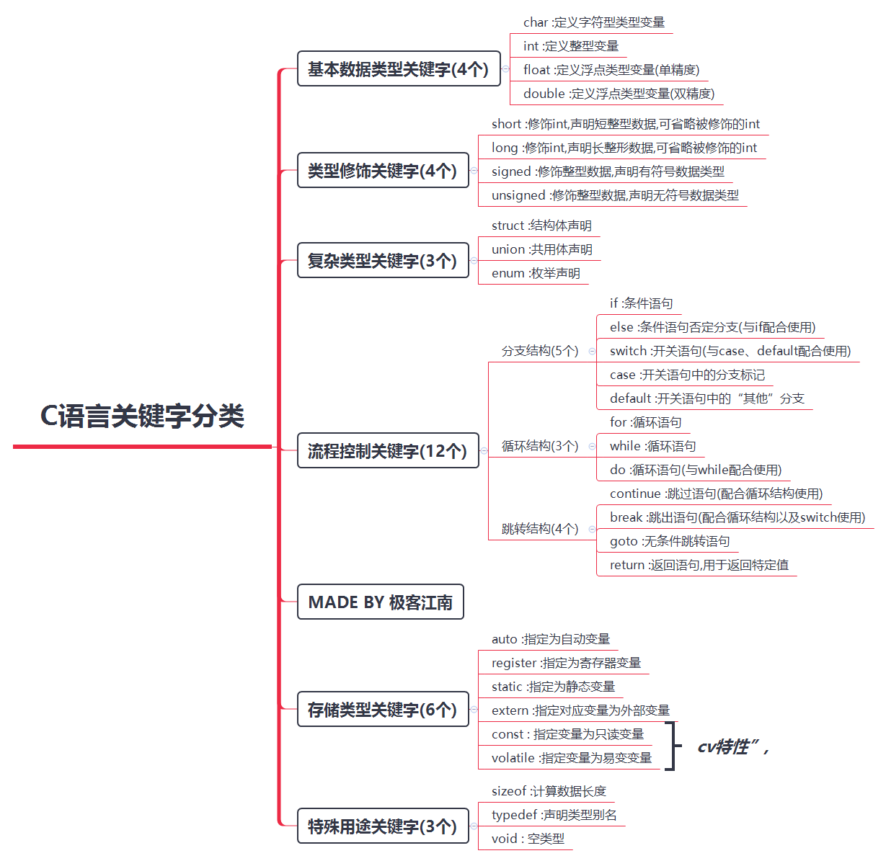

### 标识符1

C语言中的标识符只能由字母、数字和下划线三种字符组成，且第一个字符必须是字母或下划线。

标识符是用户编程时使用的名字，比如指定某个东西、人，都要用到它，他或她的名字。在电脑语言中，对于变量，常量，函数，语句块也有名字，统统称之为标识符。


### 变量

局部变量可以与全局变量同名，在函数内引用这个变量时，会用到同名的局部变量，而不会用到全局变量。

### ！！！

文件命名时最好别用，存储路径最好别用中文和空格。

一些编译器可能会出一些莫名其妙的bug.

血与泪的教训。

### 关键字



### i++

```c
i++ == i = i+1
```

### 标识符

将 `classNumber `的值变为 7

```c
#define classNumber 7
a = classNumber;
```

### 自加自减


`a++` 先参与运算，再自加。

`++a` 先自加，再参与预算。

### 强制类型转换

```c
printf("pow(3,%d) = %d\n",i,(int)pow(3,i));
//(int) 将double 转换为int
```

### 双目运算符&&

当&&两边均为真时，结果为真

单个用的话、是取地址符号。取一个量的值。
两个一起用的话，是"与"的意思。两边的，它与它，怎样怎样。

### 不等于

`！=`

### Fibonacci数列

> Fibonacci数列，中文名为斐波那契数列。它的特点是，前面相邻两项之和等于后一项的值。

### return 0

return 0 是函数的返回值,

函数中要写明return 0,表示返回。

因为函数(除void)在遇到return时才能返回。

一定要有,代表程序结束。

**用途**：return 0用来告知程序的结束。

### 数组

数组名保存的就是数组的地址，而不是值。

```c
int *p;
p = array;   // p == array 
```

`在定义的同时部分初始化，没有被定义的元素会被初始化为0；`

### 跳过本次循环与退出循环

continue和break的区别：如标题。

“break和continue语句。break语句可以用于switch或循环体内,作用是跳出switch或循环体。continue语句只能用于循环体内,作用是结束当前循环,进入下次循环。

