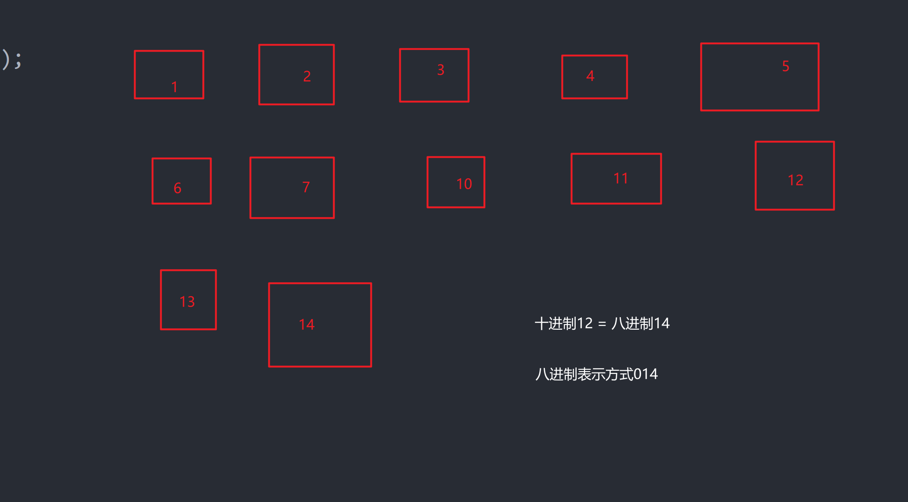

### 基础知识

一个字节 = 八个二进制位

- 二进制 **0b**
- 八进制 **0**
- 十进制 **0x**

计算方法，缝几进制进几。



### 如何输出

```c
%i  %d   //十进制

%o    //八进制
    
%x    //十六进制
    
 // 没有提供二进制的占位符
```

### 二进制

二进制的最高位为符号位；

`最高位为0 是整数`

`最高位是1 是负数`

