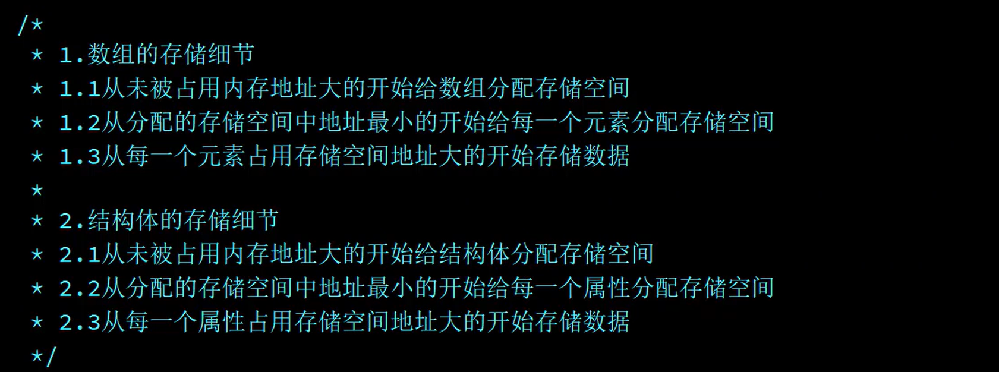

### 什么是结构体

结构体(struct)是由一系列具有相同类型或不同类型的数据项构成的数据集合，这些数据项称为**结构体的成员**。如上面的student结构体包含三个成员，分别是name、num、age。

结构体是C语言中的一种构造类型。

### 存储细节



### 第一种写法

```c
#include <stdio.h>
// 结构体变量
int main()
{
	struct Person//定义结构体类型
	{
		char *name;
		int ages;
		float score;
	};//注意要分号
	struct Person per;
	per.name = "Make";
	per.ages = 22;
	per.score = 12.5;
	printf("%d", per.ages);
}
```

### 第二种写法

```c
struct//定义结构体类型的同时定义结构体变量
	{
		char *name;
		int ages;
		float score;
	}per;
```

### 注意点

```c
	per2 = (struct Person){"john",25,25.5}; //强制类型转换
```

