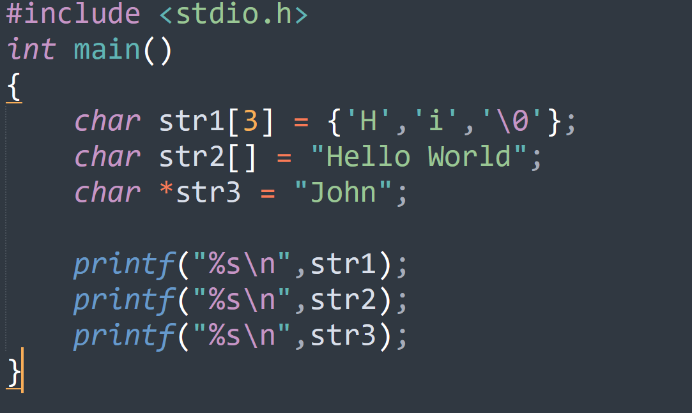
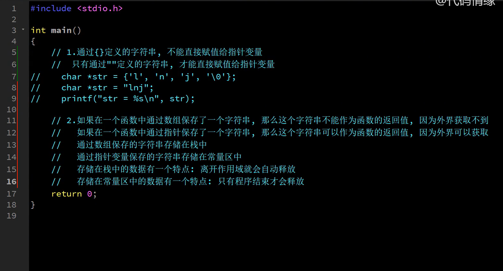
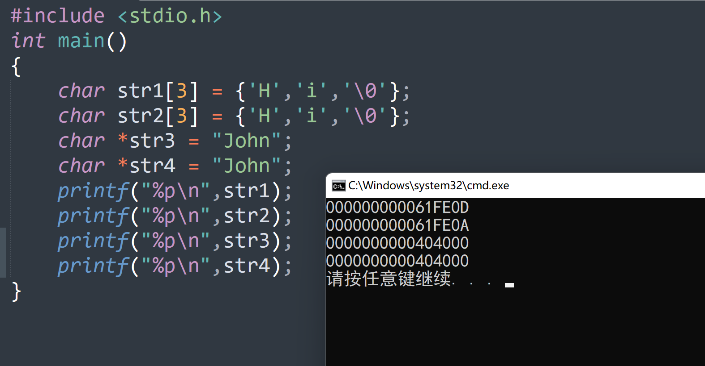

### 定义字符串的三种方式

- 数组
- 双引号
- 指针

第三种：把数组John的地址返回给str3

#### 注意点

1. 通过数组变量接受的字符串存储在栈区（可以被修改）

   

2. 通过指针变量接受的字符串存储在常量区**（不能被修改）**

3. **3.1** 通过数组变量接收字符串，哪怕字符串中的数据相同，每次定义也会重新分配存储空间
   **3.2** 通过指针变量接收字符串，只要字符串中的数据相同，就只有第一次定义会分配存储空间

#### 存储细节

在内存中找到一个位置，从最高位取四个字节，从低位开始存储

### 字符串相关函数

1. **strcat**  字符串拼接
2. **strcpt**  字符串拷贝
3. **strcmp**  字符串比较

