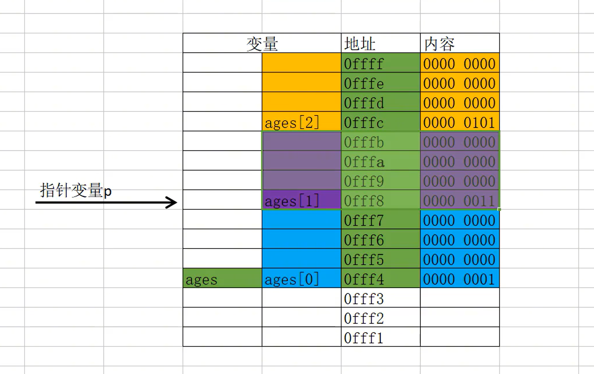
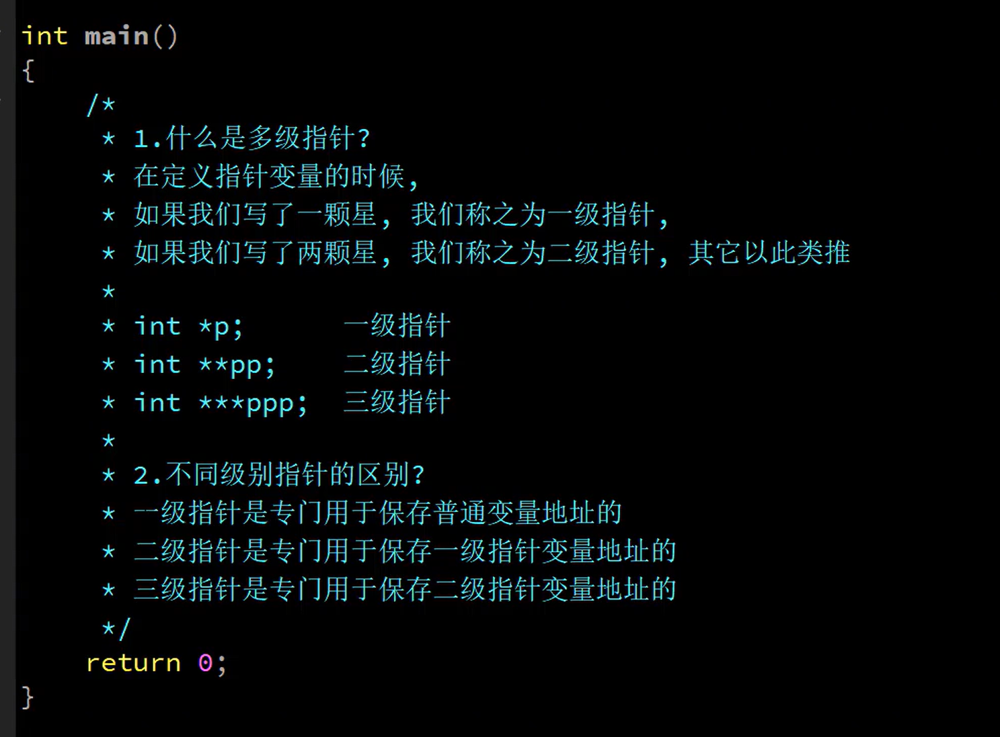
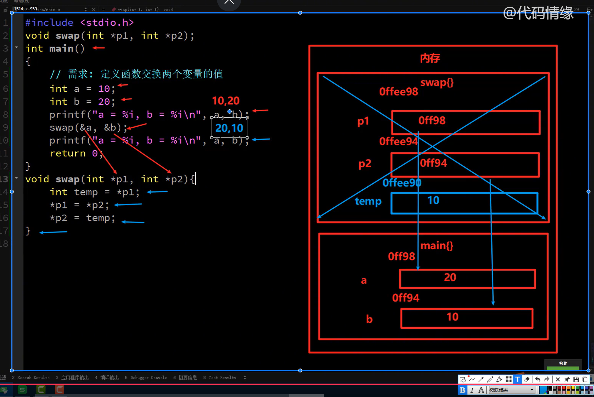

### 什么是指针变量


### 注意事项

- 一个普通变量可同时被多个指针变量指向。
- 一个指针变量的的指向是可以变的。
- 指针变量的类型必须和普通变量的类型保持一致
- 一颗*代表访问一个箭头
- 指针变量在32位系统中占用4个字节，在64位系统中占用8个字节。

##### 代码示例

```c
#include <stdio.h>
int main()
{
	int nums = 666;
	int* p;
	p = &nums;
	printf("%p\n", &nums);
}
```

指针变量的数据类型是专门告诉操作系统，在访问指向存储空间的时候，需要取出多少个字节的数据。

### 指针变量指向数组



在使用数组作为函数的形式参数时，最好使用指针变量来接受。

因为数组名就是数组的地址，传递的也是地址。

范例

```c
#include <stdio.h>
void change(int *p);
int main()
{
	int ages[] = {1,3,6};
	printf("ages[1] = %d\n", ages[1]);
	change(ages);
	printf("ages[1] = %d\n", ages[1]);
}
void change(int *p)
{
	p[1] = 666;
}
```

### 多级指针





