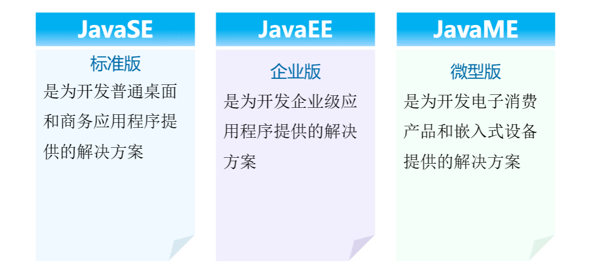
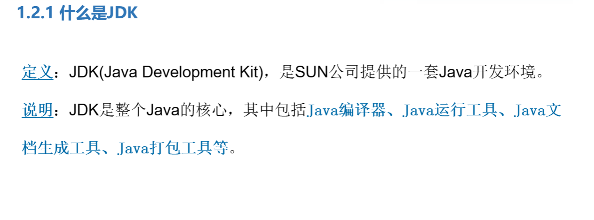

## 1、java的版本

1.1 java跨平台的实现原理：

引入了虚拟机 **JVM**

### 2、什么是JDK



## 第一个程序

```java
public class HelloWorld {
    public static void main(String[] args){
        System.out.println("你好，世界");
    }
}
```

> IDEA的快捷键：main -> so

### 解释

- class 关键字：用于在 Java 中声明一个类。
- public 关键字：一个表示可见性的访问修饰符。
- static 关键字：我们可以用它来声明任何一个方法，被 static 修饰后的方法称之为静态方法。静态方法不需要为其创建对象就能调用。
- void 关键字：表示该方法不返回任何值。
- main 关键字：表示该方法为主方法，也就是程序运行的入口。`main()` 方法由 Java 虚拟机执行，配合上 static 关键字后，可以不用创建对象就可以调用，可以节省不少内存空间。
- `String [] args`：`main()` 方法的参数，类型为 String 数组，参数名为 args。
- `System.out.println()`：一个 Java 语句，一般情况下是将传递的参数打印到控制台。System 是 java.lang 包中的一个 final 类，该类提供的设施包括标准输入，标准输出和错误输出流等等。out 是 System 类的静态成员字段，类型为 PrintStream，它与主机的标准输出控制台进行映射。println 是 PrintStream 类的一个方法，通过调用 print 方法并添加一个换行符实现的。

### .class 文件和 .java 文件的区别

.java 是源代码，也就是我们开发人员可以看懂的，可以编写的；.class 是字节码文件，是经过 javac 编译后的文件，是交给 [JVM](https://tobebetterjavaer.com/jvm/what-is-jvm.html) 执行的文件。

### java的执行过程

.java文件经过 `javac` 编译成 .class (字节码文件），接着通过java命令去执行字节码文件。之后由JIT或者JVM去处理字节码

