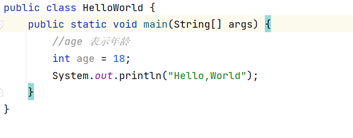
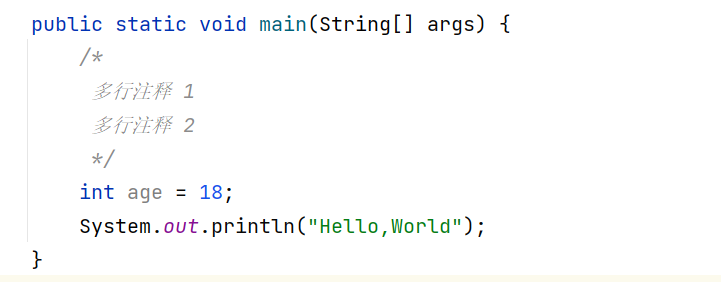

## 注释的分类

### 单行注释

使用 `//`，在代码的上方另起一行

### 多行注释

`/*注释*/`

> PS：在 Intellij IDEA 中，按下 `/**` 后敲下回车键就可以自动添加文档注释的格式，`*/` 是自动补全的。

### 文档注释

文档注释可以用在类，字段和方法，用来解释他们是干什么的。

我们可以使用 `javadoc` 命令来生成注释描述文档

### 注释规约

1) 类、字段、方法必须使用文档注释，不能使用单行注释和多行注释。因为注释文档在 IDE 编辑窗口中可以悬浮提示，提高编码效率。
2) 所有的[抽象方法](https://tobebetterjavaer.com/oo/abstract.html)(包括接口中的方法)必须要用 Javadoc 注释、除了返回值、参数、 异常说明外，还必须指出该方法做什么事情，实现什么功能。
3) 所有的类都必须添加创建者和创建日期。
4) 所有的[枚举](https://tobebetterjavaer.com/basic-extra-meal/enum.html)类型字段必须要有注释，说明每个数据项的用途。
5) 代码修改的同时，注释也要进行相应的修改。