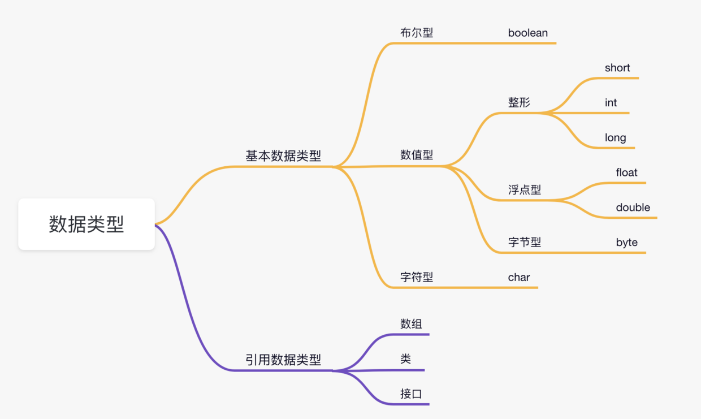
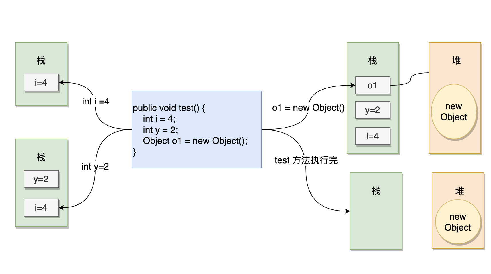

### 前言

java是一种静态类型的语言，这意味着所有变量必须在使用前就声明好，也就是得先指定变量的类型和名称

### 数据类型的分类



### 数据类型的大小

| 数据类型 | 默认值   | 大小   |
| -------- | -------- | ------ |
| boolean  | false    | 1 比特 |
| char     | '\u0000' | 2 字节 |
| byte     | 0        | 1 字节 |
| short    | 0        | 2 字节 |
| int      | 0        | 4 字节 |
| long     | 0L       | 8 字节 |
| float    | 0.0f     | 4 字节 |
| double   | 0.0      | 8 字节 |

### 变量的分类

- 局部变量
- 成员变量
- 静态变量

1、当变量是局部变量的时候，必须得先初始化，否则编译器不允许你使用它

2、当变量是成员变量或者静态变量时，可以不进行初始化，它们会有一个默认值

### 引用数据类型

基本数据类型在作为成员变量和静态变量的时候有默认值，引用数据类型也有的（学完数组&字符串，以及面向对象编程后会更加清楚，这里先简单过一下）。

### 基本数据类型和引用数据类型之间最大的差别

基本数据类型：

- 1、变量名指向具体的数值。
- 2、基本数据类型存储在栈上。

引用数据类型：

- 1、变量名指向的是存储对象的内存地址，在栈上。
- 2、内存地址指向的对象存储在堆上。

### 堆和栈

看到这，三妹是不是又要问，“堆是什么，栈又是什么？”

堆是堆（heap），栈是栈（stack），如果看到“堆栈”的话，请不要怀疑自己，那是翻译的错，堆栈也是栈，反正我很不喜欢“堆栈”这种叫法，容易让新人掉坑里。

堆是在程序运行时在内存中申请的空间（可理解为动态的过程）；切记，不是在编译时；因此，Java 中的对象就放在这里，这样做的好处就是：

> 当需要一个对象时，只需要通过 new 关键字写一行代码即可，当执行这行代码时，会自动在内存的“堆”区分配空间——这样就很灵活。

栈，能够和处理器（CPU，也就是脑子）直接关联，因此访问速度更快。既然访问速度快，要好好利用啊！Java 就把对象的引用放在栈里。为什么呢？因为引用的使用频率高吗？

不是的，因为 Java 在编译程序时，必须明确的知道存储在栈里的东西的生命周期，否则就没法释放旧的内存来开辟新的内存空间存放引用——空间就那么大，前浪要把后浪拍死在沙滩上啊。

这么说就理解了吧？

如果还不理解的话，可以看一下这个视频，讲的非常不错：[什么是堆？什么是栈？他们之间有什么区别和联系？](https://www.zhihu.com/question/19729973/answer/2238950166)

用图来表示一下，左侧是栈，右侧是堆。


这里再补充一些额外的知识点，能看懂就继续吸收，看不懂可以先去学下一节，以后再来补，没关系的。学习就是这样，可以跳过，可以温故。

举个例子。


```java
String a = new String("沉默王二")
```

这段代码会先在堆里创建一个 沉默王二的字符串对象，然后再把对象的引用 a 放到栈里面。这里面还会涉及到[字符串常量池open in new window](https://tobebetterjavaer.com/string/constant-pool.html)，后面会讲。

那么对于这样一段代码，有基本数据类型的变量，有引用类型的变量，堆和栈都是如何存储他们的呢？


```java
public void test()
{
    int i = 4;
    int y = 2;
    Object o1 = new Object();
}
```

我来画个图表示下。



应该一目了然了吧？

### 基本数据类型缓存池

- `new Integer(18)` 每次都会新建一个对象;
- `Integer.valueOf(18)` 会使⽤用缓存池中的对象，多次调用只会取同⼀一个对象的引用。

```java
Integer x = new Integer(18);
Integer y = new Integer(18);
System.out.println(x == y);

Integer z = Integer.valueOf(18);
Integer k = Integer.valueOf(18);
System.out.println(z == k);

Integer m = Integer.valueOf(300);
Integer p = Integer.valueOf(300);
System.out.println(m == p);

// false
// true
// false
```

基本数据类型的包装类除了 Float 和 Double 之外，其他六个包装器类（Byte、Short、Integer、Long、Character、Boolean）都有常量缓存池。

- Byte：-128~127，也就是所有的 byte 值
- Short：-128~127
- Long：-128~127
- Character：\u0000 - \u007F
- Boolean：true 和 false

拿 Integer 来举例子，Integer 类内部中内置了 256 个 Integer 类型的缓存数据，当使用的数据范围在 -128~127 之间时，会直接返回常量池中数据的引用，而不是创建对象，超过这个范围时会创建新的对象。

18 在 -128~127 之间，300 不在。