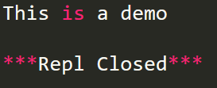
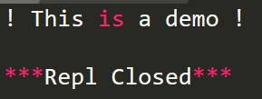
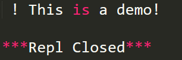
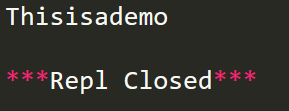
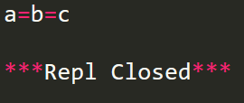

# **Python关于去除字符串中空格的方法**

在编写程序时我们经常会遇到需要将字符串中的空格去掉的情况，通常我们可以使用下面几种解决方法：

 

1、strip()方法：该方法只能把字符串头和尾的空格去掉，但是不能将字符串中间的空格去掉。

```
s=' This is a demo '

print(s.strip())
```

 

 

 

 

 

lstrip()：该方法只能把字符串最左边的空格去掉。

```
s=' ! This is a demo '

l='!'

print(s.lstrip()+l)
```

 

 

 

 

rstrip()：该方法只能把字符串最右边的空格去掉。

```
s=' ! This is a demo '

l='!'

print(s.rstrip()+l)
```

 

 

 

 

2.replace(m,n)方法：将字符串里面的m替换为n。

```
#将字符串中所有的空格删除

s=' This is a demo '

print(s.replace(' ',''))
```

 

 

 

 

 

 3.split(s，num)方法：split（s,num）

```
#使用join()方法将字符串中所有的空格删除

s=' This is a demo '

print(''.join(s.split()))
```

 

 

 

 

其中，join() 方法用于将序列中的元素以指定的字符连接生成一个新的字符串。

格式如下：

s.join(sequence)

元素之间的分隔符是s，sequence是要连接的元素序列。

```
#使用“=”将字符串序列连接起来

s="="

#字符串序列

seq=("a", "b", "c")

print(s.join(seq))
```

 

