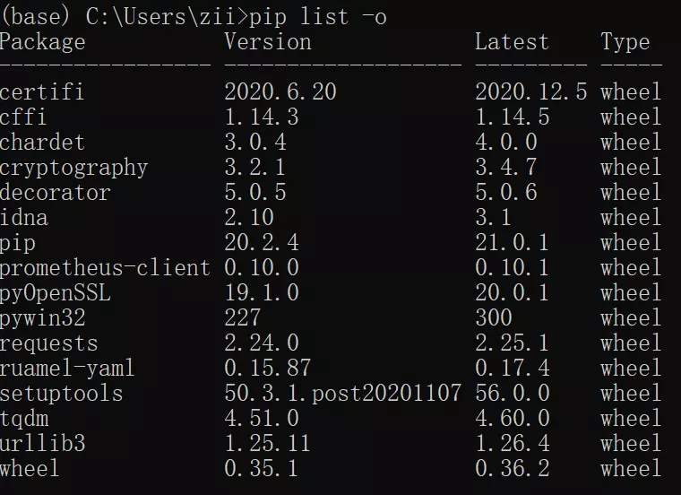

**「注：因为pip是一个命令行程序，所以pip一般都在命令行中执行各种操作。」**

## 1、安装pip

从Python 3.4开始，pip已经内置在Python中，所以无需再次安装。

如果你的Python版本没有pip，那可以使用下面两种方法安装。

(1) 命令行中输入`easy_install pip`，非常快捷

(2) 在下面网址中下载pip安装文件，然后解压到python scripts目录中，执行`python setup.py install`安装即可

下载网址：https://pypi.org/project/pip/#files


## 2、查看pip版本

`pip --version`

## 3、升级pip

如果pip的版本太低，可以升级当前版本
`pip install --upgrade pip`

## 4、获取帮助

想了解如何使用pip，以及pip有哪些功能，执行下面语句可以获取详细教程:
`pip help`

## 5、安装库

使用pip安装第三方库，执行下面语句
`pip install package_name`

指定package版本：
`pip install package_name==1.1.2`

比如说，我要安装3.4.1版本的matplotlib
`pip install matplotlib==3.4.1`

## 6、批量安装库

如果一个项目需要安装很多库，那可以批量安装：
`pip install -r e:\\requirements.txt`

`requirements.txt`文件内容格式如下：

## 7、使用wheel文件安装库

这种方法适合离线安装，wheel文件是库的源文件，可以下载后放到本地安装。

步骤如下：

(1) 在下面网站里找相应库的.whl文件
https://www.lfd.uci.edu/~gohlke/pythonlibs/

(2) 下载.whl文件，注意对应的版本


(3) 在.whl所在文件夹内，按Shift键+鼠标右键，打开CMD窗口或者PowerShell

(4) 输入命令：
`pip install matplotlib‑3.4.1‑cp39‑cp39‑win_amd64.whl`
即可完成安装

## 8、卸载库

安装好的库可以再卸载：
`pip uninstall package_name`

## 9、升级库

对当前库进行版本升级:
`pip install --upgrade package_name`

## 10、查看库信息

`pip show -f package_name`

## 11、查看已安装的库

列出所有已安装的第三方库和对应版本
`pip list`

## 12、将库列表保存到指定文件中

把已经安装的库信息保存到到本地txt文件中：
`pip freeze > requirements.txt`

## 13、查看需要升级的库

目前已经安装的库中，看哪些需要版本升级
`pip list -o`


## 14、检查兼容问题

验证已安装的库是否有兼容依赖问题
`pip check package-name`


## 15、下载库到本地

将库下载到本地指定文件，保存为whl格式
`pip download package_name -d "要保存的文件路径"`


## 附：更换pip源

很多人抱怨pip安装库有些时候太慢了，那是pip源的问题。

前面说过pip从PyPi中下载库文件，但由于PyPi服务器在国外，访问起来很慢。

但国内提供了很多镜像源，用来替代PyPi，像清华源、豆瓣源、阿里云源等。

这些镜像源备份了PyPi里的数据，由于服务器在国内，速度会快很多。

但镜像源数据有滞后性，比如说清华源的pypi 镜像每 5 分钟同步一次。

使用镜像源有两种方式，以清华源为例：

(1) 临时使用

```
pip install -i https://pypi.tuna.tsinghua.edu.cn/simple some-package matplotlib
```

除了matplotlib是要安装的库名外，其他都是固定格式

(2) 设为默认

```
pip config set global.index-url https://pypi.tuna.tsinghua.edu.cn/simple
```

设为默认后，以后安装库都是从清华源下载，而且无需再加镜像源网址

附主流镜像源地址

- 清华：https://pypi.tuna.tsinghua.edu.cn/simple
- 阿里云：http://mirrors.aliyun.com/pypi/simple/
- 中国科技大学 https://pypi.mirrors.ustc.edu.cn/simple/
- 华中理工大学：http://pypi.hustunique.com/
- 山东理工大学：http://pypi.sdutlinux.org/
- 豆瓣：http://pypi.douban.com/simple/

