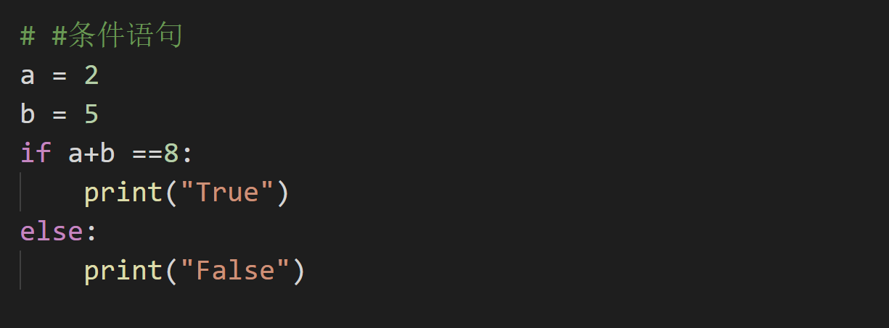

### if

编写格式



#### 注意点

1. if 后面的表达式可以有一个，也可以有多个。如果有多个，就使用and或者or连接。

## if elif

```python
if score >= 90:
    level = "优秀"
elif score >= 80:
    level = "良好"
elif score >= 60:
    level = "合格"
else:
    level = "不合格"

```

条件1为false，就到条件二，一直到最后。
