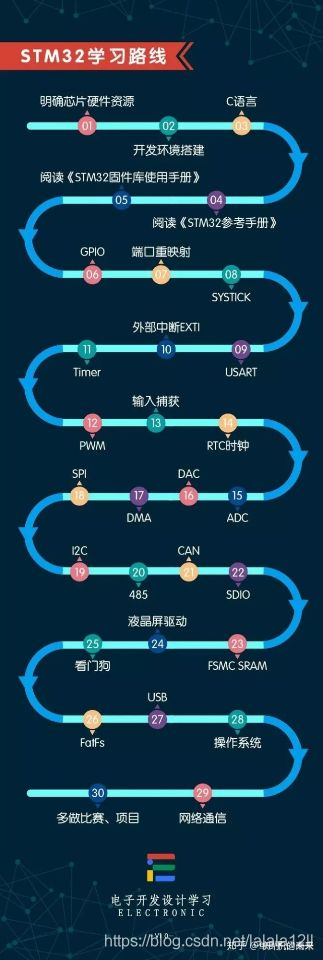

## 元器件相关

在线模拟：tinkercad

[必备元器件知识1——电阻_坏坏太兲眞的博客-CSDN博客](https://blog.csdn.net/weixin_47783699/article/details/128092840?spm=1001.2014.3001.5502)

## 入门

stm32入坑指南：https://www.guyuehome.com/36087

学习路线：

## 串口学习

[STM32F103标准库开发-Uart串口通信实验-初始化配置 (stmicroelectronics.cn)](https://shequ.stmicroelectronics.cn/thread-636701-1-1.html)