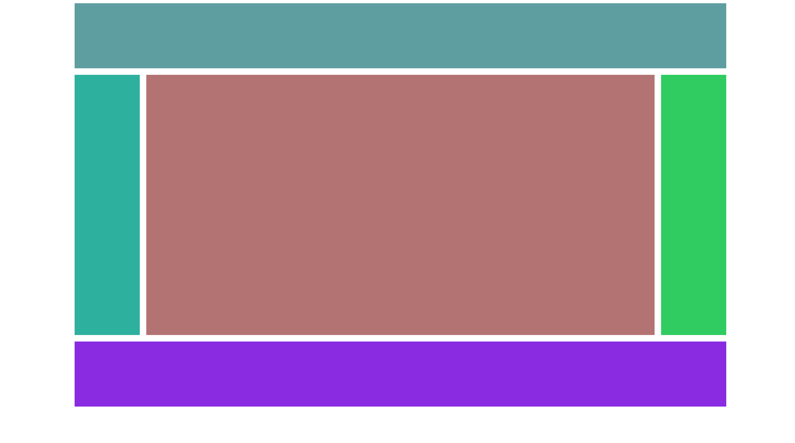
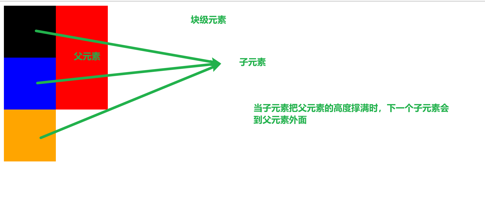

## 上下布局



### 代码示例
```html
<!doctype html>
<html lang="zh-CN">
<head>
    <meta charset="UTF-8">
    <meta name="viewport"
          content="width=device-width, user-scalable=no, initial-scale=1.0, maximum-scale=1.0, minimum-scale=1.0">
    <meta http-equiv="X-UA-Compatible" content="ie=edge">
    <title>布局</title>
    <style>
        header,main,footer{
            width: 1000px;
            margin: 0 auto;
        }
        header{
            height: 100px;
            background-color: cadetblue;
        }
        main{
            height: 400px;
            background-color: dodgerblue;
            margin: 10px auto;
        }
        main nav{
            width: 100px;
            height: 100%;
            background-color: #2eb09e;
            float: left;
        }
        main article {
            width: 800px;
            height: 100%;
            background-color: #b47373;
            float: left;
        }
        main aside {
            width: 100px;
            height: 100%;
            background-color: #30cc61;
            float: left;
        }
        footer{
            height: 100px;
            background-color: blueviolet;
        }
    </style>
</head>
<body>
<header></header>
<main>
<!--  左侧导航  -->
    <nav></nav>
    <article></article>
    <aside></aside>
</main>
<footer></footer>
</body>
</html>
```

## 块级元素溢出



## 高度塌陷

在默认情况下，父元素的高度由子元素撑开，当子元素浮动起来后，父元素的高度就会丢失。

`BFC (Block Formatting Context)`  块级格式化环境

是 CSS 内的一个隐含的属性，可以为一个元素开启 BFC，开启 BFC 后该元素会变成一个独立的区域。

元素开启 BFC 之后的一些特点：

1. 开启 BFC 的元素不会被浮动元素所覆盖。
2. 开启 BFC 的元素，子元素和父元素外边距不会重叠。
3. 开启 BFC 的元素，可以包含浮动的元素。（高度由浮动元素控制）

### 如何开启 BFC

可以通过一些特殊的方式开启 BFC 。

1. 设置元素的浮动（父元素也浮动）（不推荐）
2. 将元素设置为行内块元素。（不推荐）
3. 将元素的 overflow 设置成为一个非 visible 的值

> 常用的方式  overflow: hidden;  使其可以包含浮动元素。

### 使用伪类解决高度塌陷的问题

1. 给父元素再添加一个子元素，使用另一个子元素的伪类去撑开父元素。

2. 也可以给另一个子元素添加 `clear: both;`
3. 直接父元素添加一个after 伪类，撑开父元素的高度。

代码示例：

```css
.box1::after{
    content: "";
    clear: both;
    display: block;
}
```

### clearfix

**该样式既可以解决高度塌陷问题，也可以解决垂直外边距重叠问题**

```css
.clearfix::after,.clearfix::before{
    content: '';
    display: table;
    clear: both;
}
```

