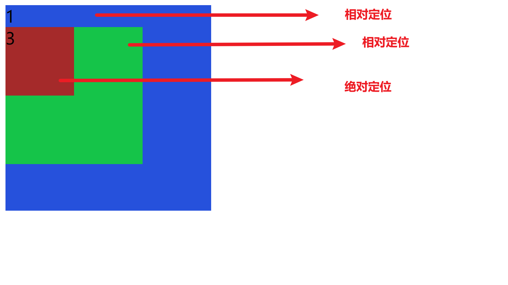

# position - 定位

一种更加高级的布局手段。通过定位可以将元素摆放到任意位置

1. `static`  默认值
2. `relative`  相对定位
3. `absolute`  绝对定位
4. `fixed`  固定定位
5. `sticky`  粘滞定位


## 偏移量

**偏移量**：当元素开启了定位以后，可以通过偏移量来设置元素的位置

- `top`  定位元素和定位位置上面的距离。
- `left`
- `right`
- `bottom`

## 相对定位

会占用原来的位置。

参照点：**元素自身在原文档流中的位置**

1. 开启相对定位，如果不设置偏移量不会发生任何变化。

2. 相对定位会提升元素的层级，会遮住下面的元素。
3. （但是不脱离文档流）
4. 相对定位不会改变元素的性质，块级还是块级

## 绝对定位



参照点：**距离绝对定位元素最近的一个开启了定位的父元素**

特点：

1. 开启绝对定位，如果不设置偏移量元素的**位置**不会发生变化。
2. 开启绝对定位，元素会从文档流中脱离。
3. 绝对定位会改变元素的性质。（因为脱离了文档流，行内变成块，没设置宽高的话块的宽高被内容撑开）
4. 会提升元素的层级
5. 绝对定位元素是相对于其包含块定位的。

### 包含块

- 正常布局情况下：包含块就是离当前元素最近的祖先块元素。
- 绝对定位的包含块：就是离他最近的开启了定位的祖先元素。如果所有的祖先元素都没有开启定位，则根元素就是包含块。html（根元素，初始包含块）

### 布局等式

当我们为元素开启绝对定位后，水平方向的布局等式就由七个变成了九个

`margin-left + margin-right + border-left + border-right + padding-left + padding-right + width + left + right`


全局居中：

```css
margin: auto;
top: 0;
right: 0;
bottom: 0;
left: 0;
```


## 固定定位

固定定位也是一种绝对定位。所有固定定位的大部分特点都和绝对定位一样。

唯一不同的是，固定定位用于参照于浏览器的视口进行定位。（浏览器滚动时，视口的位置不会变。用于在屏幕左上角。）

## 粘滞定位

粘滞定位和相对定位基本一致，不同的是，可以在元素到达到某个位置时，将其固定。

比如上导航栏先移动，在固定

```css
position: sticky;
top: 0;
```

## margin-left和left的区别

left是定位中出现的概念 是偏移量 而margin-left 是两个div(盒子)之间的外边距,而当参照标准一样时，left和margin-left没什么区别，当参照标准不一样的时候，区别就大了

使用left需要元素本身开启定位。而使用margin-left则不需要开启定位。

## 对margin值的理解

①父子关系时，margin-left是指孩子左边界线与父亲左边界线(若父亲有左padding值，指的就是这条padding线)的距离。

②兄弟关系时，margin-left指的是我的左边界线与我左兄弟的右边界线(若兄弟有右padding值，指的就是这条padding线)之间的距离。
