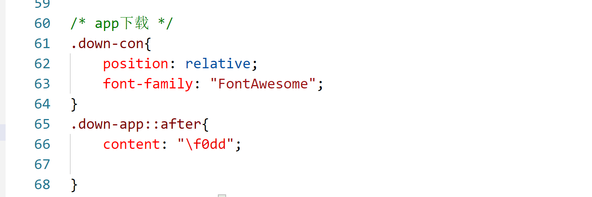

## 字体大小

**font-size**

1. px 像素
2. em  相对于当前元素的一个尺寸
3. rem 相对于根元素的的一个尺寸

## 行高 - line height

定义：文字占有的实际高度（默认1.33）

行高可以直接指定一个大小，可以px，em，rem。

也可以设置整数，如果是整数就代表行高是字体的倍数。

> 行高还经常用来设置行间距。（行高 - 字体大小）

## 字体框

字体框就是字体存在的格子，设置font-size，实际就是设置字体框的大小。

行高会在字体框的上下平均分配。

## 字体简写

语法：`font: 字体大小 / 行高，字体族`

加粗字体样式 以及 行高如果不写会设置默认值。会覆盖之前设置的行高。


```css
font: bold italic 34px "consolas";
```

font-weight：**bold**：加粗 （100 ~ 900）九个级别。需要用户字体库支持

font-style：字体风格（italic  斜体）

## 字体族

**font-family**

**大的字体分类**：具体用哪个字体由浏览器决定

1. serif  衬线字体，字体边缘具有明显的艺术修饰效果
2. sans-serif  非衬线字体，字体比划一般粗细均匀、清晰
3. monospace 等宽字体，主要针对英文，每个字符的宽度一致

可以同时指定多个字体，使用逗号隔开。有空格或特殊符号的字体用引号引起了。

## 外部字体


```css
/* 可以将服务器中的字体提供给用户去使用, 可以同时指定多个字体 */
@font-face {
    /* 我们给字体的起的名字 */
    font-family: "myFont";
    src: url(font/FiraSans-Regular.ttf);
}
```

问题：加载速度慢，版权问题。

## 图标字体 iconfont

在使用图标的时候，我们可以通过font-face 的形式引入图标。这样我们就可以通过字体来使用图标了，设置颜色，设置大小。

1. 下载font-awesome

2. 将 css 和 webfont 移动到项目中。
3. 引入 CSS (all.css)

### 使用图标字体

1、直接通过类名使用图标字体。`<i class="fas fa-bell"></i>`

2、另一种方式通过伪元素设置图标字体

1. 找到需要添加图标的伪元素，
2. 设置 content 中 图标的编码
3. 设置图标字体的 font-family

```css
div::before{
    content: "\f005";
    font-family: "Font Awesome 6 Free";
}
```


3、还可以通过实体设置 `&#x图标编码;`，设置的同时需要加类

```css
<span class="fas">&#xf0f3;</span><span>hhhh</span>
```



## 阿里fonticon

1. unicode 引用

