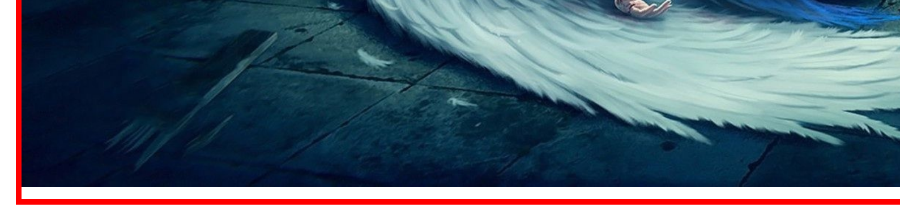

## 文本水平对齐

`text-align`：

	- left  左侧对齐
	- right  右侧对齐
	- center  居中对齐
	- justify 两端对齐

## 文本垂直对齐

`vertical-align`：

	- baseline  基线对齐
	- top  顶线对齐
	- bottom  底线对齐
	- middle  居中对齐（当前元素中线对齐父元素的中线）

## 图片基线问题



图片底部默认对齐基线（baseline）。所以会在元素的下方有一处留白，要解决这个可以使用 vertical-align 让图片对齐 top 或其他的位置。就可以消除这个空白。

## 文本修饰 - text-decoration

可选值：

	- none  无修饰
	- underline  下划线
	- line-through  删除线
	- overline  上划线

指定颜色的上划线：`text-decoration: overline red;`

## white-space 如何处理空白

可选参数：

	- normal  正常
	- nowrap  不换行
	- pre  保留空白

设置文本溢出后出现三个点

```css
width: 200px;
/* 文本不换行 */
white-space: nowrap;
/* 溢出隐藏 */
overflow: hidden;
/* 文本溢出提示 */
text-overflow: ellipsis;
```

