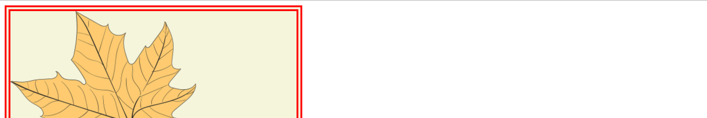
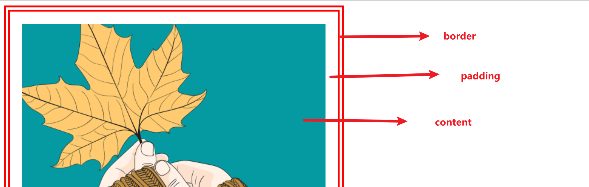
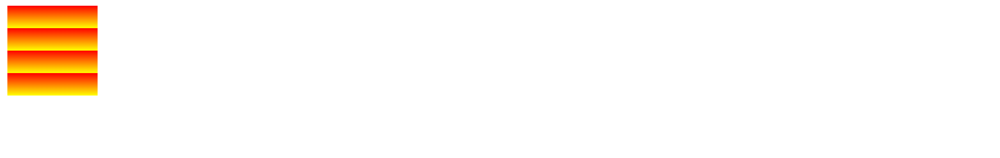
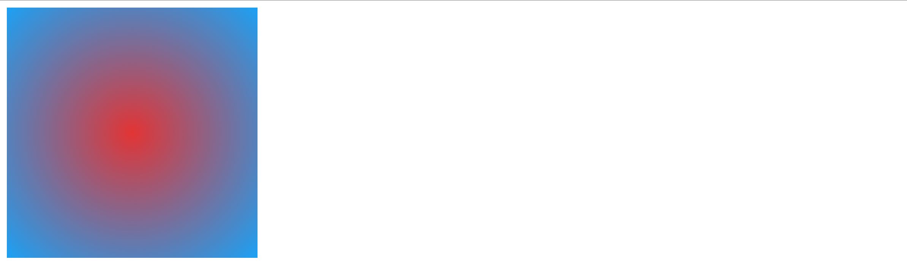

## 背景简写

`background`

可以设置背景相关的一些列属性。

```css
background:#bfa url(./bg.jpg) left/contain no-repeat;
/* size 需要写到 position 后面 */
```


## 图片尺寸

当一张大图片放到一个小容器设置背景时，就会出现显示不完整的情况。

`background-size：宽度 高度`

高度填满，宽度自动

```css
background-size: auto 100%;
```

background-size：

- cover：图片比例不变，铺满元素。(高度100% 宽度auto)
- contain：图片比例不变，图片完整显示在元素中（宽度100% 高度auto)

## 重复

设置背景的重复方式

- repeat 默认值：背景沿着x,y轴重复
-  repeat-x;repeat-y：单方向重复
-  no-repeat：不重复

## 位置

设置背景的位置 , 通过top，left，right，bottom，center 设置图片的位置。

```css
background-position: bottom right;
/* 设置两个值 ,如果只写一个，则第二个默认是center */
```

设置偏移量（左偏移量 上偏移量）

```css
background-position: 10px 10px;
```

## 边框

默认情况下，元素的边框也是有背景存在的。



不希望边框下面有背景可以使用 background-clip

## 背景的范围

`background-clip`

- border-box  默认值，背景会出现在 **外边框和内边框以及内容区** 下面。
- padding-box  背景会出现在 **内边框和内容区** 里面
- content-box  背景只出现在 **内容区** 。



## 偏移原点

背景图片偏移量计算的原

`background-origin`

- padding-box：默认值，从内边框处开始计算
- content-box：从内容区左上角开始计算
- border-box：从边框处开始计算

## 背景移动

background-attachment：背景图片是否随着元素一起移动。

- scroll  默认值，随着元素移动
- fixed  背景固定，不移动。

## 解决图片闪烁问题

可以将多个小图片保存到一个大图片中，如何在通过CSS设置他的位置。

这个技术在网页应用中十分广泛，被称为 CSS-sprite  精灵图；雪碧图

## 雪碧图的使用

1. 确定需要使用的图标
2. 侧栏图标的大小
3. 根据测量结果创建一个元素
4. 将雪碧图设置为元素的背景图片
5. 通过background-posiztion 设置偏移量以显示一个正确的图标

## 渐变

通过渐变可以设置一些复杂的背景，一个颜色向其他的颜色过渡的效果。

> 渐变是图片，需要 background-image 来设置


### 线性渐变

默认从上到下渐变（可以同时指定多种颜色）


```css
background-image: linear-gradient(to right, #d4213f,rgb(8, 135, 220));
/* to 方向 */

background-image: linear-gradient(60deg, #d4213f,rgb(8, 135, 220));
/* deg 指定度数渐变 */

background-image: linear-gradient(to right, #d4213f 60px,rgb(8, 135, 220));
/* 指定渐变开始的位置 */
```

渐变重复：`repeating-linear-gradient`



```css
background-image: repeating-linear-gradient(red 25px,yellow 50px);
```

## 径向渐变

放射性的效果

渐变点的形状默认是根据元素的形状变化的。



```css
background-image: radial-gradient(rgb(226, 52, 52),rgb(27, 161, 244));
```

我们也可以指定圆心的大小。

```css
background-image: radial-gradient(100px 100px,rgb(226, 52, 52),rgb(27, 161, 244));
```

指定渐变的位置

```css
background-image: radial-gradient(at top left,rgb(226, 52, 52),rgb(27, 161, 244));
```


