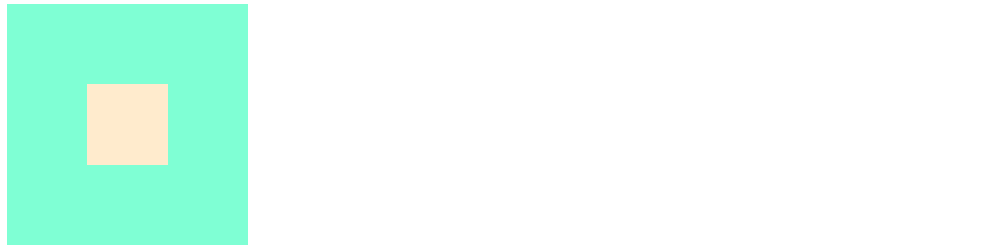

代码示例

```css
<table border="2">
    <tr>
        <th>标题1</th>
        <th>标题1</th>
        <th>标题1</th>
        <th>标题1</th>
    </tr>
    <tr>
        <td>1</td>
        <td>2</td>
        <td>3</td>
        <td>4</td>
    </tr>
    <tr>
        <td>1</td>
        <td>2</td>
        <td>3</td>
        <td>4</td>
    </tr>
    <tr>
        <td>1</td>
        <td>2</td>
        <td>3</td>
        <td>4</td>
    </tr>
</table>
```

`border-spacing`  设置边框的宽度

`border-collapse: collapse;`  设置边框合并

### 奇数行换背景

```css
tr:nth-child(odd){
    background-color: #bfa;
}
```

## table-cell 居中



```css
.box1{
    width: 300px;
    height: 300px;
    background-color: aquamarine;
    /* 将元素设置为表格 */
    display: table-cell;
    vertical-align: middle;
}
.box2{
    width: 100px;
    height: 100px;
    background-color: blanchedalmond;
    vertical-align: middle;
    margin: 0 auto;
}
```

行内块，只能和自己在一行，不能和别的元素在一行。

