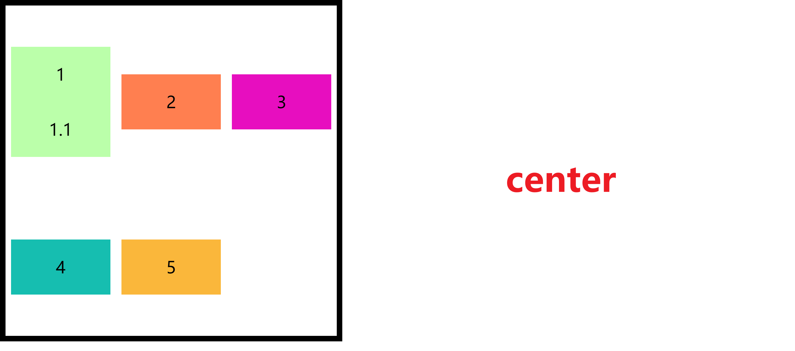

Flex - 弹性盒子，伸缩盒子

是 CSS 中的又一种布局手段，他主要用来代替浮动来完成页面的布局。

## 弹性容器


要使用弹性盒子，必须先将一个元素设置为弹性容器。通过display 来设置。

- `display: flex;`
- `display: inline-flex;`

设置完 flex 布局就会横向排列了。

### 排列方式 - flex-direction

可选值：

`row`：水平排列（默认值）

`row-reverse`：反向水平排列（自右向左排列）

`column`：纵向排列

`column-reverse`：反向纵向排列（自下向上排列）

### 自动换行 - flex-wrap

当子元素的总宽度超过容器的宽度的时是否自动换行。


可选值：

`nowrap`：不自动换行

`wrap`：自动换行

`wrap-reverse`：反向换行（反向于侧轴）


### 简写属性 - flex-flow

```css
/* 同时指定排列方向和是否换行 */
flex-flow: column wrap;
```

### 分配空白 - justify-content


可选值：

- `center`：居中排列
- `flex-start`：起始排列
- `flex-end`：终点排列
- `space-around`：空白分配到每个元素的两侧
- `space-evenly`：空白分配到每个元素一侧
- `space-between`：空白均匀分配到元素间


### 辅轴对齐 - align-items

元素在辅轴上如何对齐

可选值：

`stretch`：将元素的长度设置为相同的值（默认值）

`flex-start`：沿着辅轴边对齐，元素不会被拉伸。

`flex-end`：沿着辅轴终点对齐

`center`：居中对齐

`baseline`：基线对齐




### 辅轴空白分配 - align-content

可选值：

- `center`：居中排列
- `flex-start`：起始排列
- `flex-end`：终点排列
- `space-around`：空白分配到每个元素的两侧
- `space-between`：空白均匀分配到元素间

## 弹性元素

弹性容器的子元素是弹性元素。孙子元素以及之后的就不属于弹性元素了。

> 一个容器可以同时是弹性元素和弹性容器。

### 弹性伸展 - flex-grow

当父元素有**多余的空间**时，子元素如何伸展

```css
flex-grow: 1; /* 平均分配 */
flex-grow: 0; /* 不伸展 */

/* 剩余的空间指定比例分配 */
flex-grow: 1;
flex-grow: 2;
flex-grow: 3;
```

### 弹性收缩 - flex-shrink

```css
flex-shrink: 1; /* 等比收缩（默认值） */
flex-shrink: 0; /* 不收缩 */

/* 指定比例收缩 */
flex-shrink: 1;
flex-shrink: 2;
flex-shrink: 3;
```

### 自身辅轴空白对齐 - align-self

可以将该属性设置给自身覆盖容器的属性。

### 元素基础长度 - flex-basis

指的是元素在主轴上的基础长度。如果主轴是横向的则是宽度，是纵向的则是高度。

默认值是 auto。

```css
flex-basis: 100px;
```

### 简写属性 - flex

可以简写伸展，收缩，基础长度/宽度。

可选值：

`initial`：initial 相等于 `flex: 0 1 auto`（默认值）

`auto`：auto 相等于 `flex: 1 1 auto`

`none`：none 相等于 `flex: 0 0 auto`（没有弹性）

```css
/* 伸展 收缩 基础宽度/长度 */
flex: 1 1 auto;
```

### 指定顺序 - order

使用该属性可以指定元素在容器中的排列位置。


```css
li:nth-child(1){
    background-color: #bfa;
    order: 3;
}
li:nth-child(2){
    background-color: coral;
    order: 2;
}
li:nth-child(3){
    background-color: rgb(231, 14, 191);
    order: 1;
}
```


## 其他

### 主轴辅轴

主轴：弹性元素的**排列方向**称为主轴，设置flex-direction 实际上也就是在指定主轴。


辅轴：与主轴垂直方向的称为辅轴。

### 全局居中

```css
align-items: center;
justify-content: center;
```

### 示例


