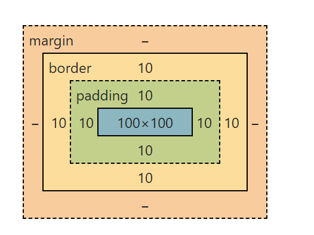
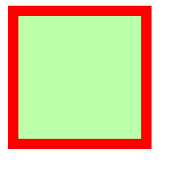

## 盒子模型

## 可见宽度

可见的宽度 = `content + 左右 padding + 左右 border` = 100px + 20px +20px == 140px

## box-sizing

用来设置盒子的计算方式，就是设置 width 和 height 的作业范围

1. `content-box`  默认值，宽高设置内容区
2. `border-box`  宽高设置范围：content+padding+border
3. 