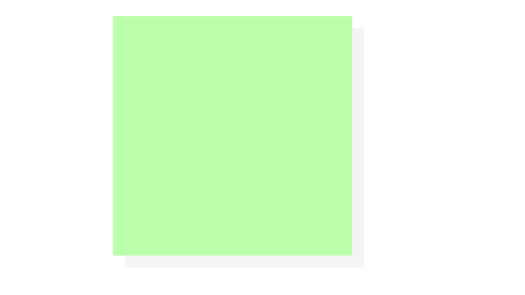

## 设置轮廓

outline 和 border 的区别是不会影响页面的布局，只是描边。不会拥挤下方的元素。

border 会拥挤下方的元素。

## 阴影-box-shadow




```css
box-shadow: 10px 10px #f4f4f4;
```

参数： `左偏移（可以取负值）下偏移（可以取负值）模糊半径  颜色`

该属性不会影响布局。

## 圆角 border-radius


```css
border-top-left-radius: 25px;
border-top-right-radius: 25px;
border-bottom-left-radius: 25px;
border-bottom-right-radius: 25px;

/* 画椭圆 */
border-top-left-radius: 25px 50px;

/* 左上右下，右上左下 */
border-radius: 100px 50px;
```

简写：`border-radius: 10px;`

