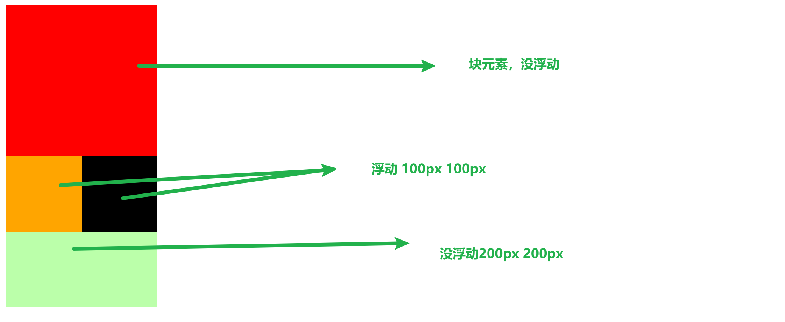

## 定义

通过浮动可以使用过元素向父元素的左侧或者右侧移动。

当我们设置了浮动后，元素就会**完全脱离文档流**。不占用文档流的位置。

水平布局的等式也失效了。

## float

`none`  默认值

`left`  向左浮动

`right`  向右浮动

## 浮动的特点

1. 浮动元素会完全脱离文档流，不再占用文档流的位置。
2. 设置浮动以后，元素会像父元素的左侧或右侧移动。
3. 元素移动时的特点，不会从父元素移出。
4. 浮动元素不会覆盖与其同等级其他的浮动元素。
5. 如果浮动元素的上边是一个没有浮动的块元素，则浮动元素无法上移。
6. 浮动元素不会超过它上边的兄弟元素，最多最多就是和它一样高。紧跟着他的兄弟元素。
7. 浮动元素不会盖住文字，文字会环绕在浮动元素的周围。所以可以利用浮动设置文字环绕图片，也就是浮动设计的初衷。
8. 元素脱离文档流后，本身的性质也会发生一些变化。块元素的宽高由内容撑开。行内元素会变成块元素。

## 简答总结

浮动的主要作业：就是可以让页面中的元素水平排列。

## clear

如果我们不希望某个元素因为其他元素的浮动而改变位置。

可以通过 clear 属性来清除浮动元素对当前元素所产生的影响。

`left`  清除左侧的影响

`right`  清除右侧的影响

原理：设置清除浮动以后，我们浏览器会自动为元素添加一个外边距，使其位置不受影响。
