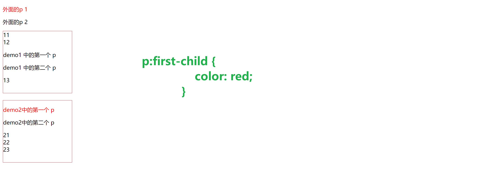
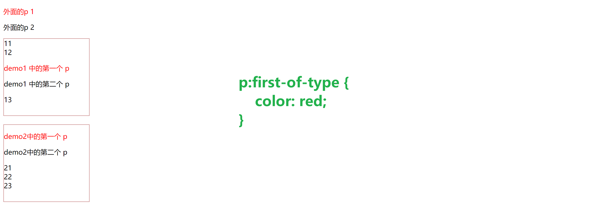
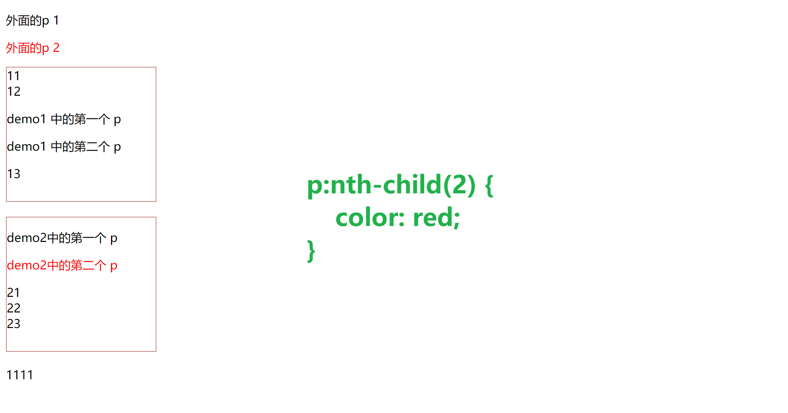
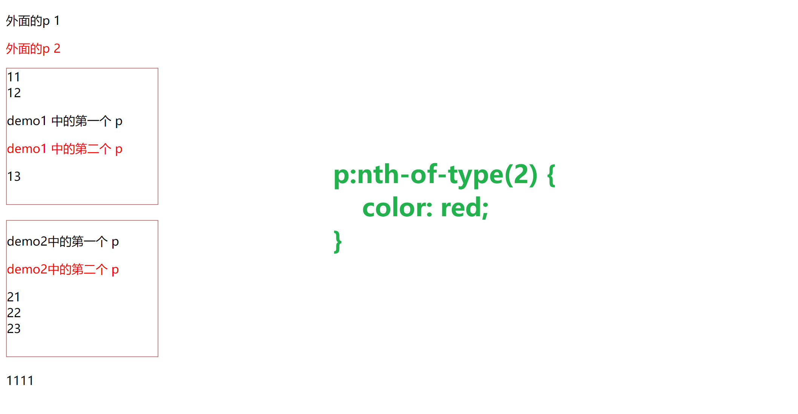

伪类选择器一般都是以 : 开头

## First-child

```CSS
/* 当前父元素的第一个子元素如果是p则生效 */
p:first-child {
    color: red;
}
```



---
## Last-child

作用和上面相反。

> 我们在调试 body 下的 last-child 可能会遇到不起作用的情况，原因是浏览器的一些调试脚本可能会在最后加上一些如 script 标签之类的。

## First-of-type

```CSS
p:first-of-type {
    color: red;
}
```



---
## Last-of-type

作用和上面相反

## Nth-child(n)

选中第n一个子元素，传n进去是全部选中，传2n或even进去是选中偶数位的元素，3n是3的倍数的元素，2n+1或odd是奇数为的元素，以此类推。

```CSS
/* 当前元素的父元素的第二个子元素如果是p则生效 */
p:nth-child(2) {
    color: red;
}
```



---
## Nth-of-type

使用方法和上面类似

```CSS
/* 选择任意层级下的第二个p */
p:nth-of-type(2) {
    color: red;
}
```



---

