## CSS的四种定位方式详解

在CSS中定位使用position属性来设置，有以下四种取值：

1. 静态定位 - **static**
2. 相对定位 - **relative**
3. 绝对定位 - **absolute**
4. 固定定位 - **fixed**

## 本文举例所用的材料

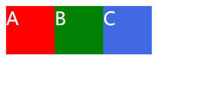

**三个不同颜色的元素，都设置了同样的大小和左浮动。**

本文的例子主要操作B元素。

## 静态定位 - **static**

静态定位是css中的默认定位方式，也就是没有定位，处于正常文档流中。

**将B元素设置为静态定位，并设置top和left属性为10px**

```css
.B {
    position: static;
    top: 10px;
    left: 10px;
}
```

效果图如下： 

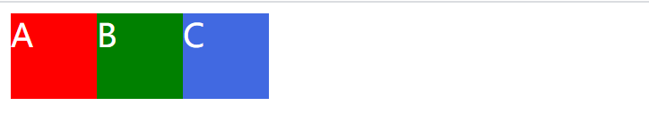

看到B元素没有任何反应，因为默认就是静态定位，在此定位方式中设置：**top，bottom，left，right，z-index** 这些属性都是无效的。

## 相对定位 - **relative**

相对定位的**相对**很有意思，只要搞清楚相对于谁就能理解相对定位的含义。

**请看下面的栗子，将B元素设置为相对定位，top和left属性都为0**

```css
.B {
    position: relative;
    top: 0;
    left: 0;
}
```

效果如下：


B元素没有反应，这是因为相对定位是**相对于自身定位**，top和left为0就相当于**原位不动**。

**再看一个例子，将top和left属性值改为10px**

**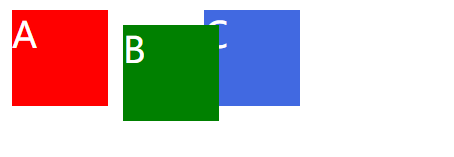**

可以看到B元素偏移了10px，并且C元素(蓝色)并没有浮到A元素旁边，而是被**无形的东西**挡住了。

**相对定位的特点就是元素本身在文档流中的占位不变，无形的东西就是B元素在文档流中的占位，这也是为什么C元素不会浮动过去的原因。可以想象成B元素的本体依然处于普通文档流中，它的替身在参照本体进行移动。(本体和替身是为了比喻，并不是官方说法)**

为了更好理解**相对于自身定位**，请看下图：

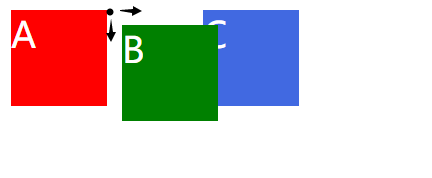

黑点表示B元素**本体的左上角**，绿色的是它的替身，可以看出替身是参照B元素本体的左上角那个点进行偏移。(本体就是透明的占位的部分)

**再将B元素宽度增加，效果如下：**

**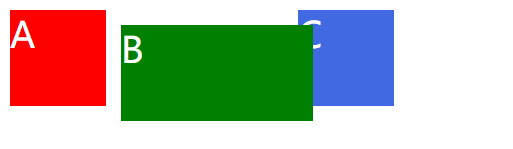**

 

可以更明显的看出B元素在普通文档流中占位的痕迹。

## 绝对定位 - **absolute**

我在刚开始学习的时候一度被**绝对**这个词所误导，以为绝对定位是想去哪就去哪。

实际上**绝对定位是参考父元素的相对定位**来实现的，听起来不好理解，我们先做个最简单的例子。

**设置B元素为绝对定位，top和left属性为0**

```css
.B {
    position: absolute;
    top: 0;
    left: 0;
}
```

效果如下：

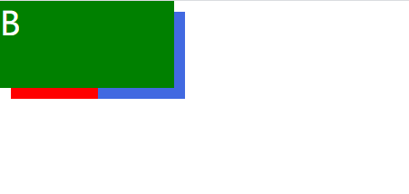

可以看到元素B被定位到了页面的左上角，并且元素B脱离了普通文档流(元素C浮到元素A旁边，没有占位)

那么我们可以认为绝对定位是参照页面左上角进行定位吗？答案是**不可以**，绝对定位并不是参照页面进行定位，而是参照父元素的**relative**进行定位，如果元素的所有父元素都没有设置**relative**，那么将参照根元素**html**进行定位，这就是B元素跑到了页面左上角的原因。

根据上述说法，假如将B元素设置为**relative**，再增加一个元素D作为子元素，设置D元素进行绝对定位是不是就会参照父元素B了呢？

**我们可以尝试一下：在B元素里加入一个子元素D，并设置B元素为相对定位，D元素为绝对定位。(B与D是父子关系)**

```css
/* 父元素 */
.B {
    position: relative;
    top: 0;
    left: 0;
}

/* 子元素 */
.D {
    position: absolute;
    top: 10px;
    left: 10px;
}
```

 

效果如下：

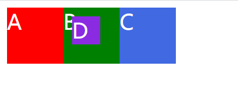

可以看出我们的结论是对的，紫色的元素D确实是参照父元素B左上角的点进行偏移的。

如果取消B元素的相对定位，那么元素D会跑到页面左上角，也就是参照html元素进行偏移。

**我们看看猜测是否正确：****取消B元素的相对定位，D元素不变**


```css
/* 父元素 */
.B {
    
}

/* 子元素 */
.D {
    position: absolute;
    top: 10px;
    left: 10px;
}
```

 

效果如下：

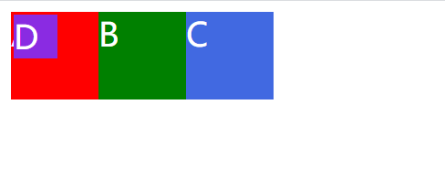

答案是正确的，因为元素D的所有父元素都没有设置relative，所以会参照根元素html进行偏移。

------

 

## 固定定位 - **fixed**

固定定位比较简单，固定定位是参照浏览器窗口的左上角进行偏移。

***\*一个简单例子：\**设置元素B为固定定位，top和left为50%**

```css
.B {
    position: fixed;
    top: 50%;
    left: 50%;
}
```

 

效果如下：

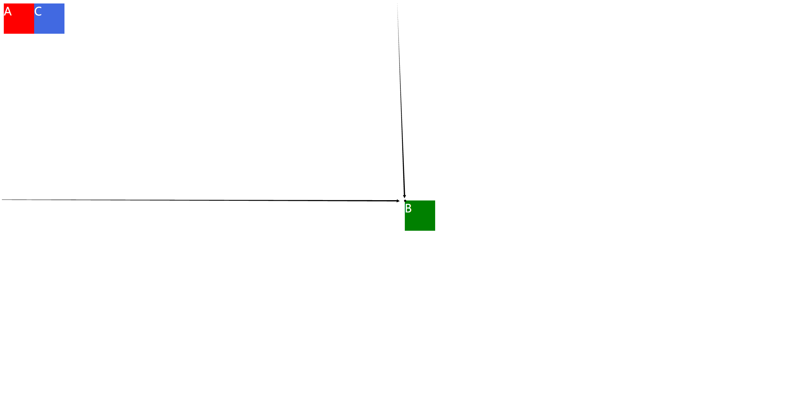


固定定位的特点就是：无论如何滑动页面，固定定位的元素位置都不会被改变，完全脱离文档流。

比如CSDN编辑页面的这个：

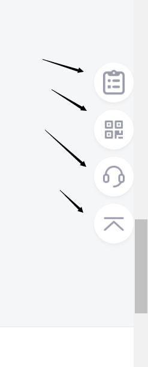

可以看到滚动条快到底了，元素位置依然不变。

**小知识：css中的定位的偏移量都是通过参照元素与被参照元素的左上角的点进行偏移，所以50%的偏移量并不是真正意义上的居中，还要减去自身宽度或高度的一半。**

------

 

## **z-index属性**

***\*z-index属性是设置元素的层级，数值低的会被数值高的遮住，举个栗子：\****

```css
/* 红色元素 */
.A {
    position: fixed;
    top: 20px;
    left: 20px;
    z-index: 3;
}

/* 绿色元素 */
.B {
    position: fixed;
    top: 40px;
    left: 40px;
    z-index: 2;
}

/* 蓝色元素 */
.C {
    position: fixed;
    top: 60px;
    left: 60px;
    z-index: 1;
}
```

效果如下：

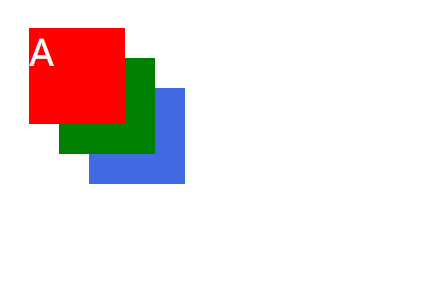

可以看到A元素的z-index值最大，所以显示在最前面。B元素(绿色)数值在两者之间，显示夹在中间。C元素(蓝色)数值最小，显示在最后被遮住。

