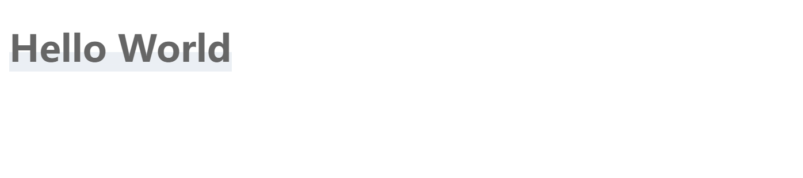

## 标题半底色

图片示例：



```css
h1{
	color: #666;
	background: linear-gradient(to bottom,transparent 60%,rgba(189,202,219,.3) 0) no-repeat;
	display: table;
	width: auto;
}
```

## 禁止复制文本

```css
-webkit-user-select: none;
-moz-user-select:none;
-ms-user-select:none;
user-selcet:none;
```

## 同时选择父元素和子元素

```css
user-select:all;
```

## 禁止拖拽

`draggable`

```html

```

## 美化滚动条
```css
::-webkit-scrollbar {
    width: 6px;
    height: 6px;
    background-color: transparent;
}
::-webkit-scrollbar-track {
    background-color: transparent;
}
::-webkit-scrollbar-thumb {
    border-radius: 3px;
    background-image: linear-gradient(135deg, #09f, #3c9);
}
```

## 全屏遮罩

```css
.loader-mask {
  position: fixed;
  top: 0;
  left: 0;
  width: 100%;
  height: 100%;
  background-color: rgba(255, 255, 255, 0.5);
  z-index: 200;
}
```

