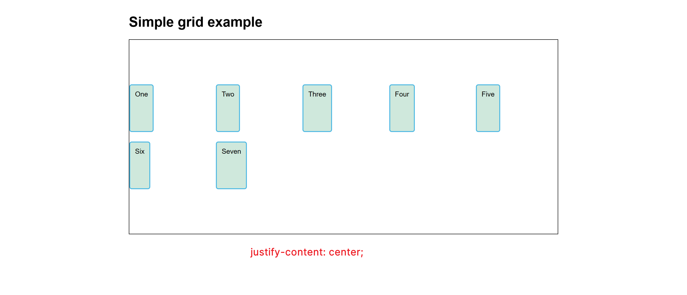

## 前置知识

- 行
- 列
- 单元格
- 容器属性
- 项目属性

## grid网格布局

> grid布局专用单位：单位：fr（浮动宽度，grid布局特有的单位）fraction(分数)

我们在理解grid布局的时候，可以想象成我们小时候写字的那种网格纸。


## 容器属性

先说说容器属性：

### 行宽列宽

```css
display:grid
指定一个布局为网格布局

grid-template-columns: 150px 150px 150px;
设置列的宽度，有几个数值就代表有几列，每列的宽度对应其数值

grid-template-rows：150px 150px 150px;
设置行的宽度

grid-auto-rows: 100px;
指定元素默认的行宽
```

### 行间距列间距

```css
/* 控制行间距 */
row-gap: 20px;
/* 控制列间距 */
column-gap: 10px;
```

### repeat

作用：

1、重复我们的属性值

参数：第一个参数为重复的次数，第二个参数为重复的值

```css
grid-template-rows: repeat(3, 33.33%);
```

2、重复模式

```css
grid-template-columns: repeat(2, 100px 20px 80px);
```

### auto-fill

有时候单元格的大小是固定的，但是容器的大小不确定。如果希望每一行或则每一列都尽可能的容纳更多的单元格，我们就可以使用auto-fill来自动填充

```css
.wrapper{
  display:grid;
  grid-template-columns: repeat(auto-fill, 100px)
}
```

### minmax

产生一个长度范围

```css
grid-template-columns: repeat(auto-fill,minmax(150px,1fr));
```

### 指定元素的占比

搭配着 `grid-area: xxx;` 共同使用

```css
grid-template-areas: 
    "header header header"
    "sidebar content content"
    "footer footer footer";
```

### 指定元素的排序

网格布局的默认排列方式是从左到右再到下，以行排列，当然我们也可以修改

```css
grid-auto-flow:colunm; 
```

### justify-items、align-items

调整子项目在容器当中的水平位置和垂直位置


### justify-content、align-content

整个内容区在容器中的位置



## 项目属性

### 指定元素在网格中的位置


```css
/* 开始的列和行最小为1 */
/* 指定该元素在网格中从第几列到第几列 */
grid-column-start: 1;
grid-column-end: 4;

/* 简写形式：grid-column:1/4; */


/* 指定该元素在网格中从第几行到第几行 */
grid-row-start: 1;
grid-row-end: 2;

/* 简写形式：grid-row:1/2; */
```

这些属性搭配媒体查询，在做响应式网站时非常不错。


