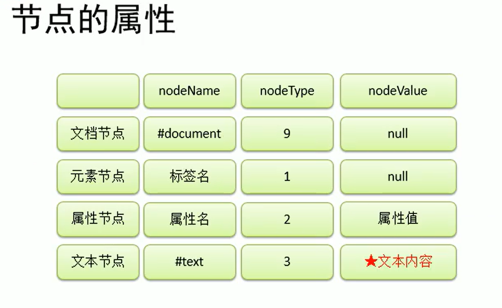
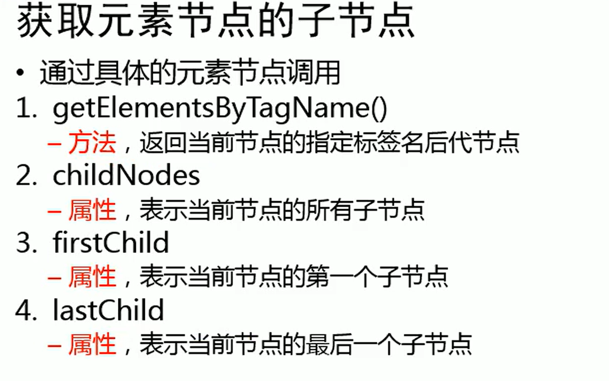

## ID选择器

选择HTML标签中的ID

```javascript
var h1 = document.getElementById("h1")
```

## 类选择器

改方法不支持IE8及以下浏览器。

```javascript
var h1 = document.getElementsByClassName('h1')
```


```javascript
// 使用 document.querySelector 获取引用
const switcher = document.querySelector('.btn')
```

## Name选择器

```javascript
<input type="checkbox"name="items"value="篮球"/>

// 获取所有name为items的元素
var items = document.getElementsByName('items')
```


## 文档对象模型

英文名称：Document Object Model



---

浏览器已经为我们提供了文档节点对象这个对象是window属性

可以在页面中使用，文档节点代表的是整个网页。

```JavaScript
console.log(document)
```

## 方法

`getElementById("ID名")`

通过ID获取元素

`getElementsByTagName()`

通过标签名获取一组元素节点对象

`getElementsByName()`

通过name属性获取一组元素节点对象

`document.querySelector()`***

需要一个选择器的字符串作为参数，可以根据一个**CSS选择器**来查询一个元素节点对象（使用该方法只会返回第一个结果）

1. 可以选择class
2. 可以选择id
3. 可以选择子元素
4. 可以选择标签

`document.querySelectorAll('div')[2]`

选择多个元素。

`document.createElement()`

可以用于创建一个元素节点对象，他需要一个标签名作为参数，将会根据该标签名创建元素节点对象，

它将创建好的对象作为返回值返回。

`document.createTextNode("广州")`

可以用来创建一个文本节点对象，

需要一个文本内容作为参数，将会根据内容创建文本节点，并将新的节点返回。

`appendChild()`

向一个父节点添加一个新的子节点。

用法：父节点.appendChild(子节点)

```JavaScript
// 创建li节点
var li = document.createElement("li")
li.innerHTML = "重庆"
city.appendChild(li)
```

`insertBefore()`

可以在指定的子节点前插入新的子节点，语法：

父节点.insertBefore(新节点，旧节点)

`replaceChild()`

替换子节点，语法：

父节点.replaceChild(新节点，旧节点)

`removeChild()`

删除子节点，语法：

父节点.removeChild(节点名)

或者`要删除的节点.parentNode.removeChild(要删除的节点)`也可以删除节点

`.innerHTML()`

获取或者修改HTML内容

```JavaScript
city.innerHTML += "<li>重庆</li>" //消耗资源更多
```

`removeAttribute`

删除元素的属性

```JavaScript
removeAttribute("属性名")
```


---



获取#city下面的所有li节点

```javascript
city.getElementsByTagName('li')
```

获取子节点

```
childNodes[0] //往往是个空格，可能需要[1]
```


## 属性

`innerHTML`

代表的是元素内部的内容

`clientWidth,clientHeight`

返回元素的可见宽度，高度。包括内容区，和内边距。

这些属性都是不带px的，返回的都是一个数字，可以直接进行计算。（只读）

`offsetWidth,offsetHeight`

返回元素的宽度，高度，包括内容区，内边距，边框

---

`left,top`

设置偏移量，该属性只对开启了定位的元素启用。

---

`offsetParent`

可以用来获取元素定位的父元素。会获取到离当前元素最近的开启了定位的元素。

## 偏移量

1. `offsetLeft` 当前元素相对于其定位父元素的水平偏移量
2. `offsetTop` 当前元素相对于其定位父元素的垂直偏移量

`scrollHeight，scrollWidth,scrollLeft,scrollLeft`

获取整个滚动区域的高度和宽度，

获取水平滚动条滚动的距离，获取垂直滚动条滚动的距离

```JavaScript
scrollHeight - scrollTop == clientHeight
// 说明滚动到底部了
```

---

## 鼠标位置

`clientX,clientY`

获取鼠标指针的水平，和垂直坐标

### 获取body的方法

```JavaScript
var body = document.getElementsByTagName('body')[0]

或者
var body = document.body
```

### 获取HTML

```JavaScript
var html = document.documentElement
```

### 获取所有元素

```JavaScript
var all = document.all
```

### 获取标签中的子元素

```JavaScript
var smallBox = document.querySelector('.bigBox div')
```

### 获取爷爷节点

```JavaScript
当前节点.parentNode.parentNode
```

## 通过JS修改元素的样式

语法

`元素.style.样式名 = 样式值`

注意，如果CSS的样式名中含有-，这种名称在JS中是不合法的比如

**background-color**需要去掉减号，把减号后面的字面变大写。

读取元素的样式

`元素.style.样式名`

注意通过style属性设置和读取的都是内联样式，无法读取样式表中的样式

## 获取指定CSS的样式

获取的样式是元素在浏览器中最终渲染效果的样式。

`getComputedStyle()`

第一个参数是要获取的元素，第二个参数可以传递一个伪元素，一般是null;

```
console.log(getComputedStyle(h1,null)["color"])
或者
console.log(getComputedStyle(h1,null).color

```

`元素.currentStyle.属性名` 仅支持IE

以上两种方法是只读的。

## 设置元素的位置案例

```JavaScript
document.onmousemove = function(event){
	event = event || window.event
	var x = event.clientX
	var y = event.clientY
	box.style.left = x+"px";
	box.style.top = y+"px";
}
```

