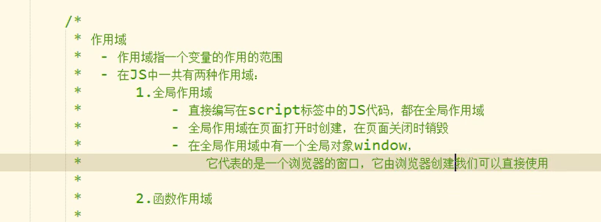
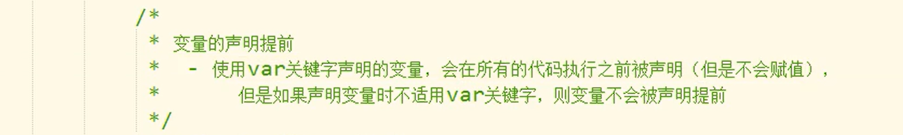
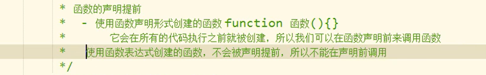

## arguments

在调用函数时，浏览器每次都会传递进两个隐含的参数：

1.函数上下文对象的this

 2.封装实参的对象arguments

- arguments是一个类数组对象，它也可以通过索引来操作数据，也可以获取长度

在调用函数时，我们传递的实参都会封装到arguments

- 我们即使不定义形参，也可以通过arguments来使用实参

```JavaScript
function fun(){
	console.log(arguments.length)
}
fun(111,222)
```

- 它里面又一个属性叫做callee，这个属性对应一个函数对象，就是当前正在运行的这个函数对象

  ```JavaScript
  function fun(){
  	console.log("2")
  	arguments.callee() //递归
  }
  fun()
  ```

  

## 立即执行函数

函数定义完，立即被调用。

```JavaScript
(function(){
	alert("我是一个匿名函数~~~~");
})();
```

## 箭头函数

箭头函数 用于简写function和{}；

```JavaScript
<script type="text/javascript">
  var myFunc = (x) => alert(x);
</script>
```

## 设置函数默认的参数

```JavaScript
function warn(temp,headline='Warning!')
```

## 返回值

可以使用`return`来设置函数的返回值，可以返回任何的数据类型

  语法： `return 变量`

如果return后面不跟任何值，则会返回undefined，不写return也是如此。

## Break和Continue,Return

使用break可以退出当前的循环，使用continue可以跳过当次循环

如i=0;i<5;i++

if i ==2 break的结果 》0,1,2

if i ==2 cotinue的结果 》0,1,3,4

使用return可以结束整个函数

## 作用域



## 变量的声明提前



## 函数的提前声明




## 函数对象的方法

简单的说：用来指定this

`call`和`apply`

当对函数调用这两个方法的时候，都会调用函数执行

在调用call和apply时，可以将一个对象指定为第一个参数，此时这个对象将会成为函数执行时的this

```JavaScript
function fun (){
	console.log(this)
}
var obj =  {}
fun() //返回window
fun.call(obj) //返回对象
```

### call方法可以将实参在对象之后依次传递

```
function fun (a,b){
	console.log(a)
	console.log(b)
}
var obj = {}
fun.call(obj,1,2)
```

### apply方法需要将实参封装到一个数组中统一传递

```
fun.apply(obj,[1,2])
```

