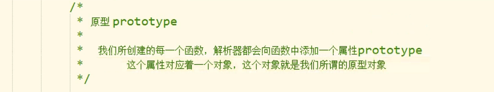
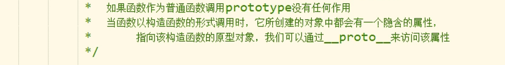
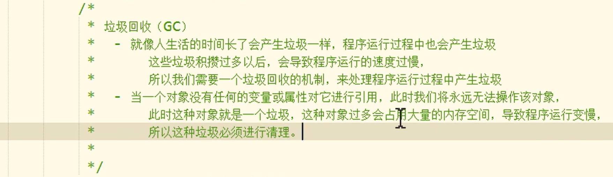

## 创建时间对象

如果直接使用构造函数创建一个Date对象，则会封装为当前代码执行的时间

```
var date = new Date();
```

创建一个指定的时间对象

```
var d2 = new Date("2016/11/2/11:13:34")
```

- getDate()  获取当前日期是几日
- getDay()  获取当前日期是星期几（星期日是0，0-6顺序）
- getMonth()  获取当前日期的月份（一月返回的是0，0-11顺序)
- getFullYear() 获取当前时间的年份
- getTime()  获取当前日期的时间戳
- Date.now()  获取当前日期的时间戳

toUTCString() 方法将日期转换为 UTC 字符串（一种日期显示标准）。

## For/In 循环

JavaScript for/in 语句遍历对象的属性：

### 实例

```JavaScript
var person = {fname:"Bill", lname:"Gates", age:62}; 

var text = "";
var x;
for (x in person) {
    text += person[x];
}
```

## 查看是否存在某属性


使用in检查对象中是否含有某个属性时，如果对象中没有，但是原型中有，也会返回True

### 单独检查对象中是否存在某个属性

**对象名.hasOwnProperty("属性名")**

`obj.hasOwnProperty("a")`

### 代码示例

```JavaScript
// 创建对象的两种方式
  // 方法一：简单
var obj = new Object();
var obj1 = new Object();
  // 方法二：命名更加自由，并且调用时可以使用变量
obj1["123"] = 123;
obj1["ada"] = 456;

// 添加属性
obj.name = 'zhangsan';

// 删除属性 delete 对象名.属性名
delete obj.name;

// 获取id
document.getElementById('h1')

// 置入内容
h1.innerHTML = obj1["ada"];

// 对象里面写函数
var obj = {
	p: function(x){
		console.log(x)
	}
}
b = 'lisi';
obj.p(b);

```

## 枚举对象中的属性

```JavaScript
var x = {
	name: 'lisi',
	age: 22,
	gender: '男'
}
for (var i in x){
	console.log(i)  //取属性名
        console.log(i+':'+x[i])  //取属性名和值
}
```


## 工厂模式创建对象

```JavaScript
function creatPerson(name,age,sex){
	var obj = new Object();
	obj = {
		name: name,
		age: age,
		sex: sex
	}
	// 返回对象
	return obj;
}
	obj1 = creatPerson('约翰',22,'男')
	console.log(obj1)
```

## 构造函数

使用同一个构造函数创建的对象，我们成为一类对象，也将一个构造函数称为一个**类**，我们将通过一个构造函数创建的对象，称为该类的实例。


```javascript
function Person(name,age){
	this.name = name;
	this.age = age;
}
var obj = new Person('孙悟空',22);
console.log(obj.name);
console.log(obj.age)
```

### 让相同类的实例共享一个方法

方法一：缺点会污染全局作用域

```javascript
function Person(name,age,gender){
	this.name = name;
	this.age = age;
	this.gender = gender;
	this.sayHi = fun;   //在外部定义函数
}
function fun(){
	console.log("Hello,大家好，我是"+this.name)
}
```

方法二：使用原型对象的方式

`Person.prototype.a = 123;`


## instanceof

`console.log(obj instanceof Person)`

## 原型对象

原型对象就相当于一个**公共的区域**，所有同一个类的实例都可以访问到这个原型对象，

我们可以将对象共有的内容，统一设置到原型对象中。





`console.log(obj1.__proto__ == Person.prototype);`

当我们访问对象的一个属性或者方法时，他会先在对象自身中查找，如果有则直接使用，如果没有则会去原型对象中查找，如果找到则直接使用。

## toString()

当我们直接在页面中打印一个对象时，实际上是输出的是对象的toString()的返回值。

该方法在对象的原型的原型当中

`console.log(obj.__proto__.__proto__.hasOwnProperty("toString"))`

## 垃圾回收



自动回收的触发机制

`obj = null;`
