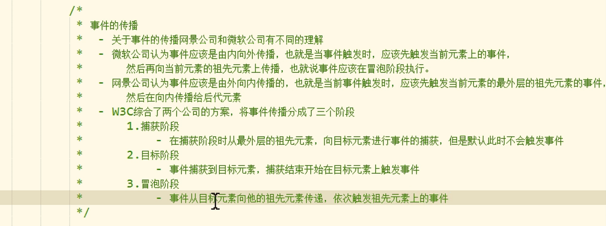

## 事件

就是用户和浏览器之间的交互行为，比如点击按钮，鼠标移到，关闭窗口。

我们可以在事件对应的属性中设置一些js代码，当这些事件被触发时，这些代码会被执行。

`onclick` 单击事件

`ondblclick` 双击事件

`click()` 模拟点击

`onload()`加载完执行

`onscroll`滚动事件

## 确认弹窗

```JavaScript
if(confirm("确认删除?")){
    tr.parentNode.removeChild(tr)
}
```

## 事件对象

当事件的响应函数触发时，浏览器每次都会将一个事件对象作为实参传递进响应函数，

在事件对象中封装了当前浏览器相关的一切信息，比如鼠标的坐标，鼠标滚轮的方向，键盘的哪个按键被按下...

`onmousemove` 鼠标移动时

`onmouseover` 鼠标悬浮时

`onmouseout` 鼠标移出时

`target`表示事件触发的对象

`onmouseup` 鼠标松开

`onmousedown` 鼠标按下

`onkeydown` 键盘按下，如果按着不松手，事件会一直触发。

`onkeyup` 键盘松开，键盘事件一般会绑定给一些可以获取到焦点的对象或者是document

该事件将会在鼠标在元素中移动时触发。

> 在IE8中，响应函数被触发时，浏览器不会传递事件对象。
>
> 在IE8及以下的浏览器中，是将事件对象作为window对象的属性保存的。

## 事件的冒泡(Bubble)

所谓事件的冒泡就是事件的向上传导，当后代元素上的事件被触发时，器祖先元素相同的事件也会被触发。

开发中大部分情况冒泡都是有用的。


```JavaScript
元素名.onmousemove = function(event){
	event.cancelBubble = true
}
//取消冒泡
```

## 事件的委派

我们希望，只绑定一次事件，即可应用到多个元素上，即使元素是后添加的。

我们可以尝试将其绑定给元素的共同的祖先元素上。

是将事件统一绑定给元素的共同祖先，这样后代元素上的事件触发时，会一直冒泡到祖先元素，从而通过祖先元素的响应函数来处理事件。

事件委派是利用了冒泡，通过委派可以减少事件的绑定的次数，提高程序的性能。

```JavaScript
ul1.onclick = function(event){
	alert(event.target)
}

if(event.target.className == "link"){
	alert("222")
}
```

target：谁被点了谁就是target

## 事件的绑定

使用对象.事件 = 函数的形式，只能同时绑定一个函数，如果绑定多个，则后面的会覆盖前面的。

可以使用下面的方法可以绑定多个

addEventListener()

参数：

1，事件的字符串，点击事件不需要on

2，回调函数，当事件触发时该函数会被使用。

3，是否在捕获阶段触发事件，需要一个布尔值，一般都传false.

```javascript
btn.addEventListener('click',function(){
	alert("222")
	alert(111)
},false)
```

> 这个方法不支持IE8及以下浏览器
>
> 在IE8中可以使用attachEvent()


## 事件的传播




如果想让事件在触发阶段就执行，那么可以使用addEventListener()方法的第三个参数。

一般情况下不用

## 按键

### 按键码

通过keyCode可以判断哪个按键被按下。

### 获取keyCode

```JavaScript
document.onkeydown = function(event){
	event = event||window.event
	console.log(event.keyCode)
}
```

### 按键名(常用)

`event.key`

### 两个按键同时按下触发案例。

```JavaScript
document.onkeydown = function(event){
	event = event||window.event
	if (event.ctrlKey&&event.key=="a") {
		console.log("222")
	}
}
```

## 取消事件冒泡


