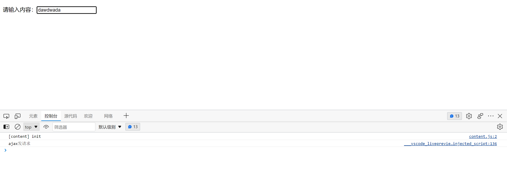
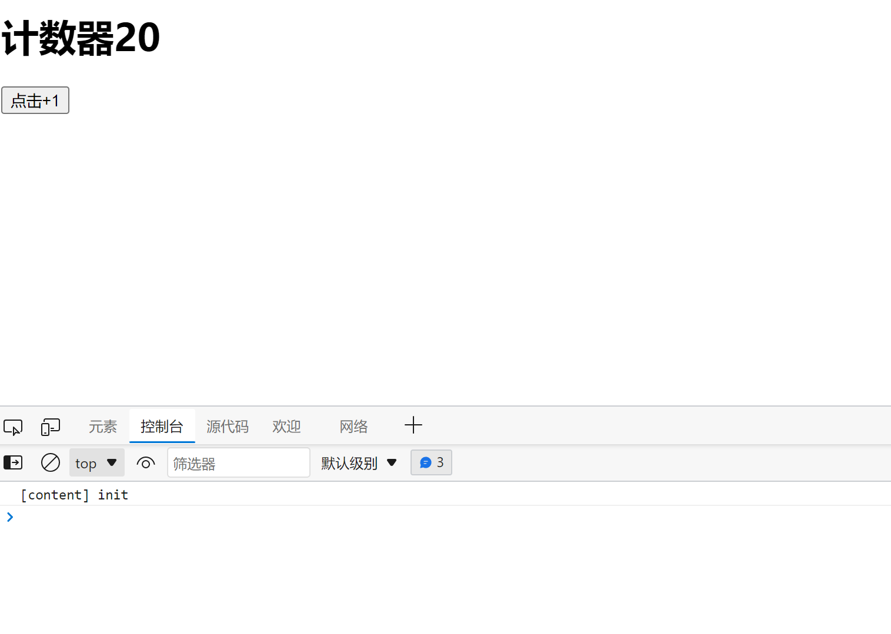

## 节流和防抖

在开发中常常会遇到函数的连续触发和高频次触发的情况。解决这些问题使用防抖和节流是最好不过的了。Lodash可以帮助我们实现。

**lodash CDN加速**  https://www.bootcdn.cn/lodash.js/

### 防抖

定义：前面所有的触发都被取消，最后一次执行在规定时间之后才会触发，也就是说如果连续快速的触发只会执行一次。防止多次触发同一个事件。

```html
<!DOCTYPE html>
<html>
  <head>
    <meta charset="UTF-8" />
    <title>防抖</title>
    <script src="https://cdn.bootcdn.net/ajax/libs/lodash.js/4.17.21/lodash.js"></script>
  </head>
  <body>
    <p>请输入内容：<input type="text" /></p>
    <script>
      let input = document.querySelector('input')
      //未使用防抖前  文本发生变化立即执行
      // input.oninput  = function () {
      //     console.log('ajax请求')
      // }


      //解决防抖  使用lodash的debounce函数   [闭包+延时器]
      input.oninput = _.debounce(function () {
        console.log('ajax发请求') //一秒后发请求
      }, 1000)
    </script>
  </body>
</html>

```

效果图：



---


### 节流

定义：在规定的时间间隔不会重复触发回调，只有在大于这个时间间隔才会触发回调，把频繁的触发变为少量触发。控制高频触发的次数。

```html
<!DOCTYPE html>
<html lang="zh-CN">
  <head>
    <meta charset="UTF-8" />
    <meta http-equiv="X-UA-Compatible" content="IE=edge" />
    <meta name="viewport" content="width=device-width, initial-scale=1.0" />
    <script
      src="https://lf26-cdn-tos.bytecdntp.com/cdn/expire-1-M/lodash.js/4.17.21/lodash.js"
      type="application/javascript"
    ></script>
    <title>Document</title>
  </head>
  <body>
    <div>
      <h1>计数器<span>0</span></h1>
      <button>点击+1</button>
    </div>
    <script>
      //获取节点
      let span = document.querySelector('span')
      let button = document.querySelector('button')
      let count = 0
      //  未使用节流前 点击一次执行一次
      button.onclick = function () {
        count++
        span.innerHTML = count
      }
      //  节流后一秒执行一次
      // button.onclick = _.throttle(function () {
      //   count++
      //   span.innerHTML = count
      // }, 1000)
    </script>
  </body>
</html>

```

效果图：



---

