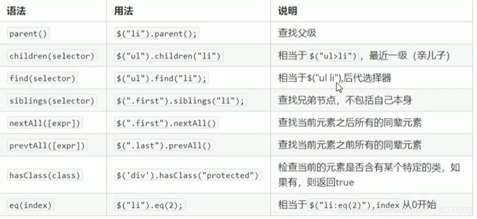

## 选择器

### 基础选择器

- 标签,id,类

- 连续选择，子代选择，后代选择
- 相邻兄弟元素选择器

```html
<body>
  <div class="box1">
    <span>Hello,我是box1</span>
  </div>
  <hr />
  <div class="box2">
    <ul>
      <li>qwq</li>
    </ul>
    <p>ul后面的第一个元素</p>
    <p>ul后面的第二个元素</p>
  </div>

  <button id="btn">按钮</button>
  <script>
    console.log(' 连续选择器 ', $('.box1,.box2'))
    console.log(' 子代选择器 ', $('.box1>span'))
    console.log(' 后代选择器 ', $('.box2 li'))
    
    //选择ul后面的所有的p元素
    // 注意是后面的而不是前后的
    $('ul~p').css('background','#eee')
    // 选择ul后面的相邻的p元素
    $('ul+p').css('background','#eee')
  </script>
</body>
```

### 筛选选择器

语法：`:名称`

`HTML`

```html
<ul>
  <li>1</li>
  <li>22</li>
  <li>333</li>
  <li>4444</li>
</ul>
```

`JS`

```JavaScript
// 选择首个元素
$('li:first').css('background','#eee')
// 选择最后一个元素
$('li:last').css('background','#eee')
// 选择指定索引元素
$('li:eq(0)').css('background','#eee')
// 选择偶数索引元素
$('li:even').css('background','#eee')
// 选择奇数索引元素
$('li:odd').css('background','#eee')
```

## 其他




| parents() | $('#li-3').parents() | 查找所有的父级元素 |
| :-------- | -------------------- | ------------------ |

