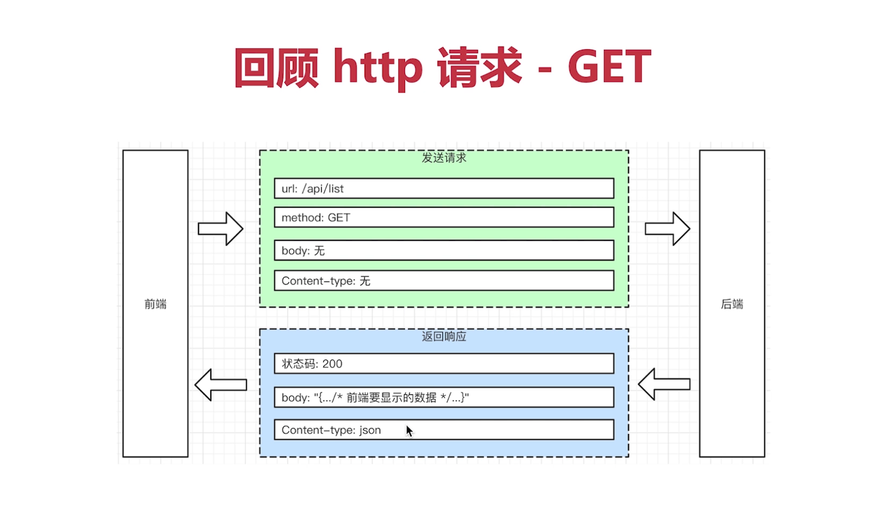
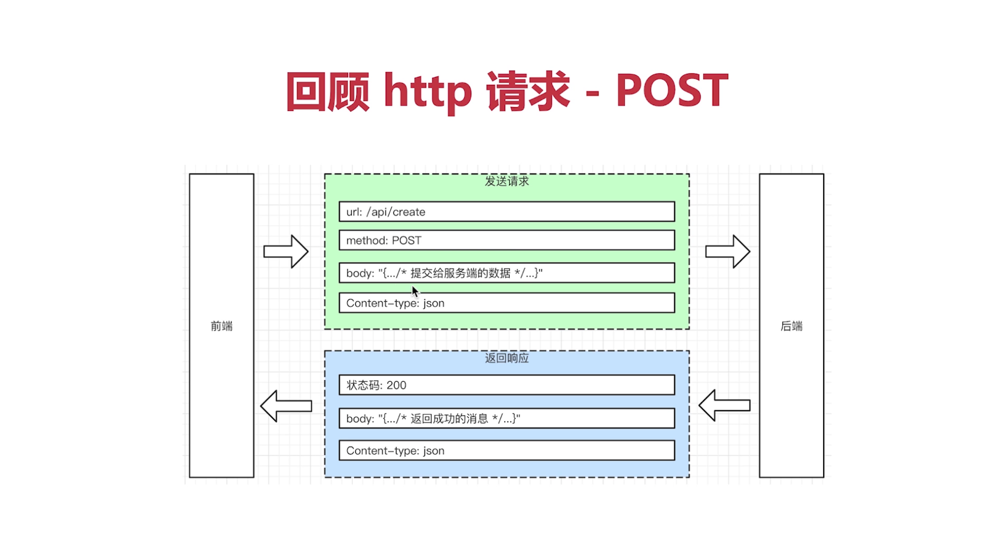
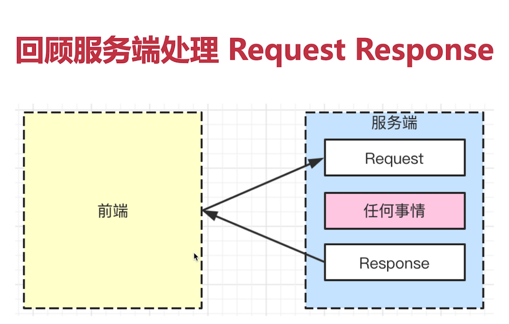
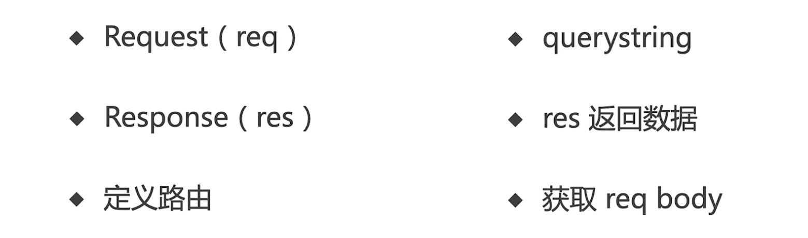

## Get请求



## Post请求



## 概览



```JavaScript
/* 
  require的三级：系统自带模块，npm安装的模块，自定义的模块
*/
const http = require('http');
const server = http.createServer(()=>{
  console.log('已经监听到')
})
server.listen(3000) //3000端口的http请求已经被监听
```

## 总结


