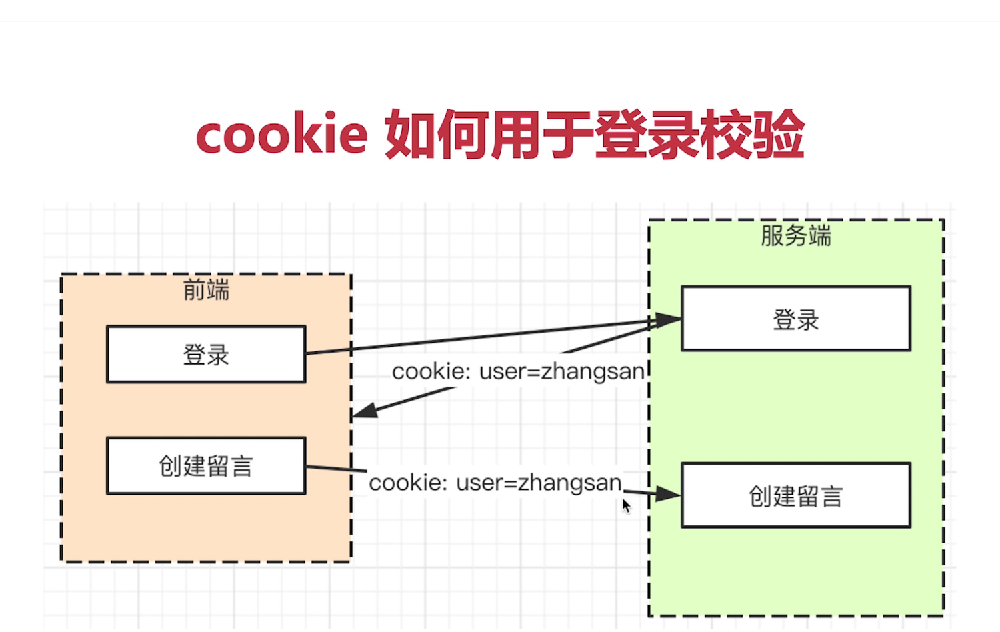
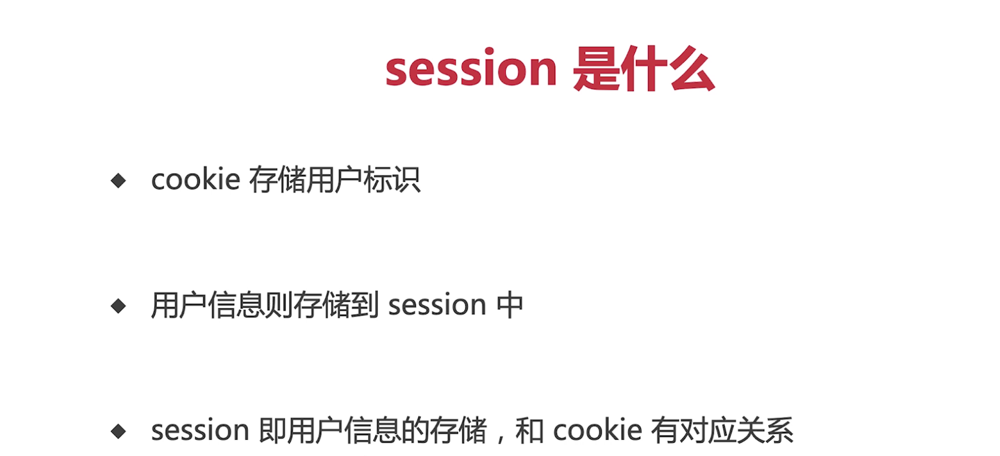

## 安装koa

```sh
npm i koa
```

## 体验koa

```javascript
const Koa = require('koa');
const app = new Koa()

/* ctx == context(上下文) */
app.use(async (ctx) => {
  ctx.body = 'hello,world!'
})

app.listen(3000)

```

## 安装koa脚手架

```sh
npm i koa-generator -g

koa --version #验证是否安装成功
```

创建项目

```sh
koa2 koa-learn  #koa和koa2不一样

cd koa-learn

npm install

npm run dev
```

如果运行 dev 命令遇到 `'.' 不是内部或外部命令，也不是可运行的程序`这个问题，可以将 **script** 中的 dev配置修改一下。

```sh
"dev": ".//node_modules/.bin/nodemon bin/www",
# 在 ./ 后面再加一个 /
```

## 路由

1. 创建路由文件定义路由并导出
2. app.js 导入路由
3. 注册路由

```JavaScript
// 获取留言列表
router.get('/list', async (ctx)=>{
  const query = ctx.query // req功能
  console.log(query)
  ctx.body = 'api list' // res功能
})

// 创建留言
router.post('/create', async (ctx) => {
  const reqBody = ctx.request.body
  console.log(reqBody) // request body
  ctx.body = 'api create'
})
```

## cookie

cookie会随着网络请求发送给后端



```JavaScript
const koa = require('koa');
const app = new koa()
app.use(async (ctx,next)=>{

  // 设置cookie
  ctx.cookies.set('a','900')
  // 获取cookie
  console.log(ctx.cookies.get('a'))
  ctx.body = 'Hello'
})
app.listen(3000)
```

## session

- cookie不能暴露用户名
- cookie存放用户明文信息，非常危险
- 解决方案：cookie里面存放一个用户标识，如userid=1211



### 模拟登录

```
koa-generic-session
```

