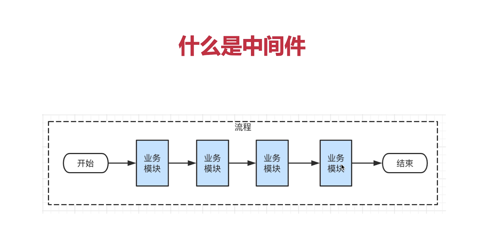
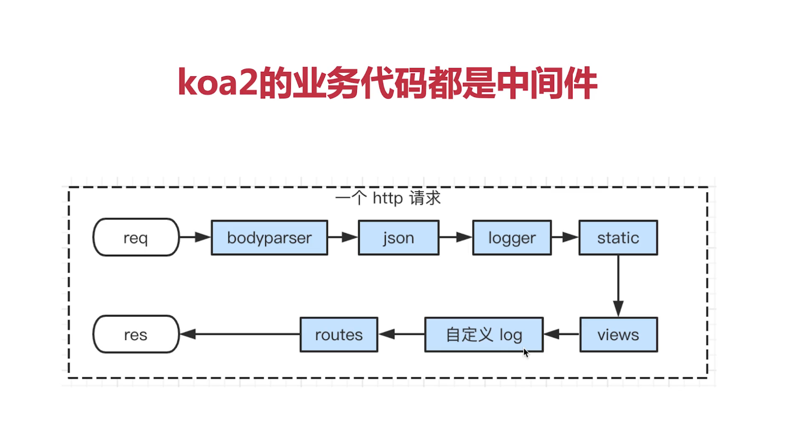
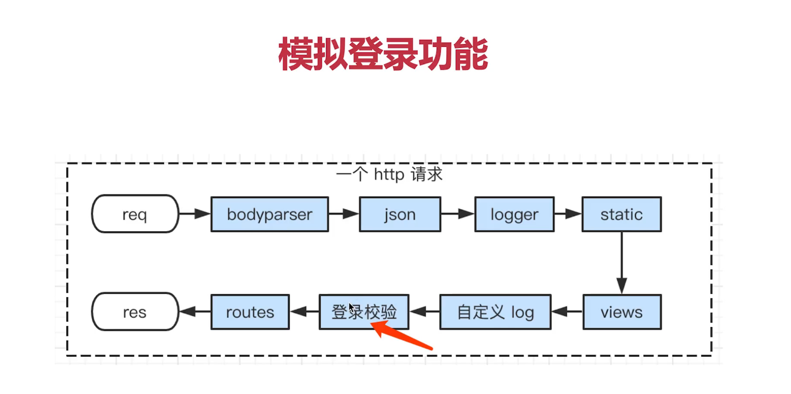

## 中间件

可扩展，可插拔



## 为什么使用中间件

拆分业务模块，使代码清晰

扩展性好，易添加，易删除

统一使用中间件，使得业务代码更加规范

## koa2中间件



所有`app.use`都是中间件

`app.use`是所有请求都会使用的 



```JavaScript
......
// 模拟登录(为了使用中间件)
app.use(async (ctx,next)=>{
  const query = ctx.query
  if(query.user === 'lisi'){
    await next()
  }else{
    ctx.body = '请登录'
  }
})

// routes
app.use(index.routes(), index.allowedMethods())
......
```

