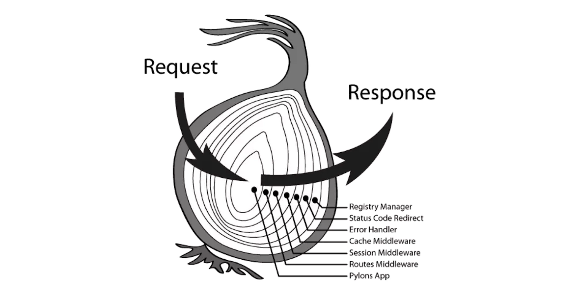

## 什么是洋葱圈模型




```JavaScript
async function getImg(url=''){
  await fetch(url) //加载图片
}

async function fn(){
  const url = 'https://ts1.cn.mm.bing.net/th/id/R-C.56fc694deb9c296f089be7510c8874a7?rik=42hqD%2fDf0BuWyw&riu=http%3a%2f%2fimg1.v.tmcdn.net%2fimg%2fh000%2fh08%2fimg20120821173754f32380.jpg&ehk=3i6xD8ylcpoKEQs4TB95Rij0UDH0ycVRuUJCMYuGFv0%3d&risl=&pid=ImgRaw&r=0&sres=1&sresct=1'
  const start = Date.now()
  await getImg(url)
  const ms = Date.now() - start
  console.log(`加载图片花费了 ${ms} 毫秒`)
}
fn()
// 代码的执行机制，先执行fn，然后执行getImg这时fn还没执行完成，等getImg执行完成由回到了fn
```

