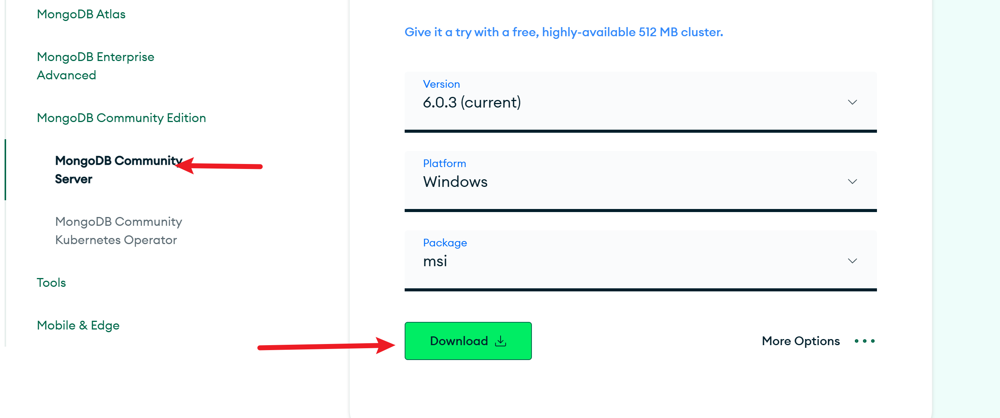
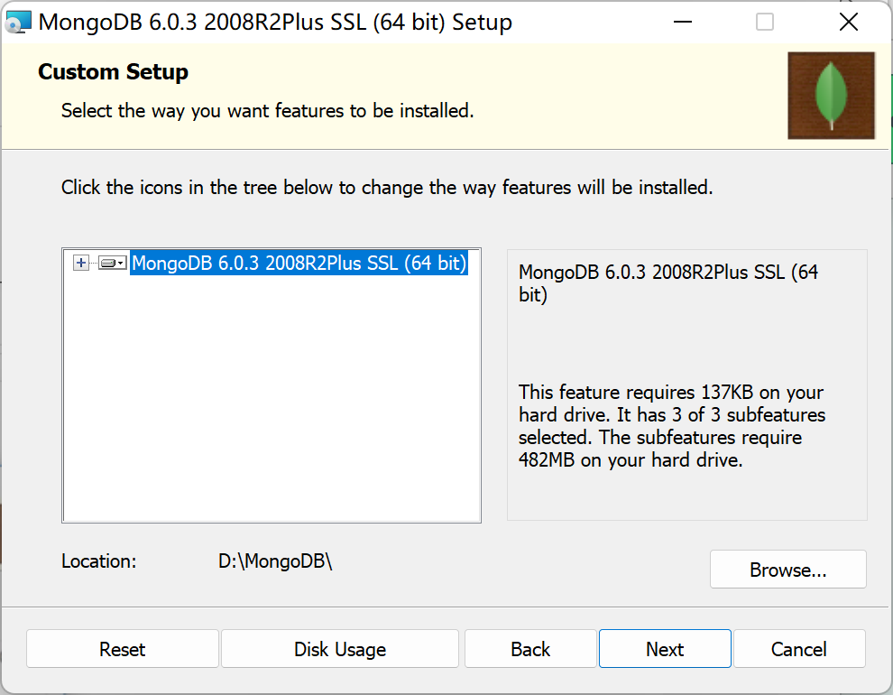
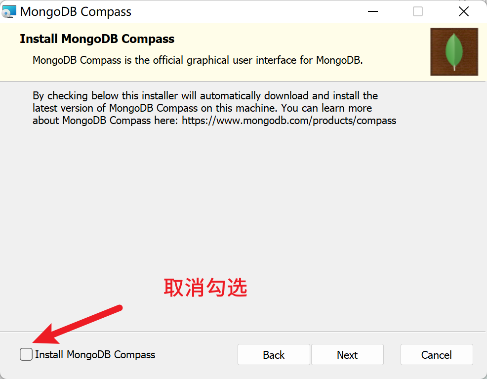
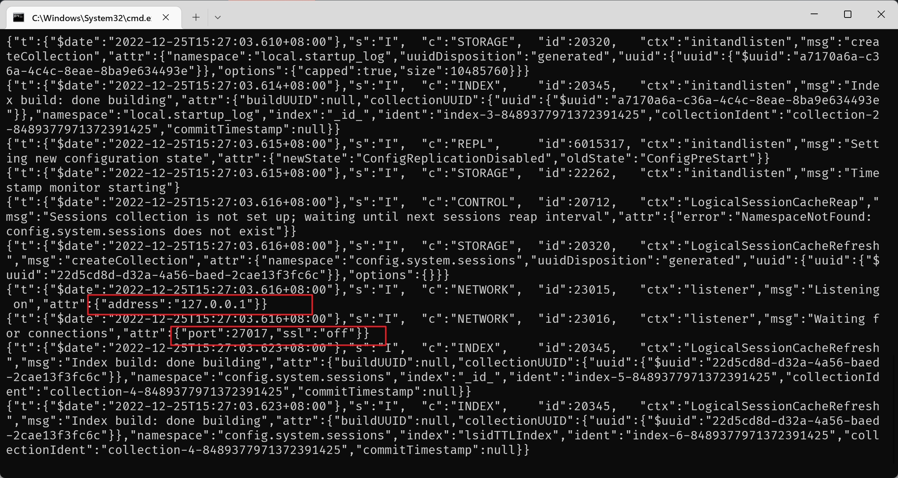
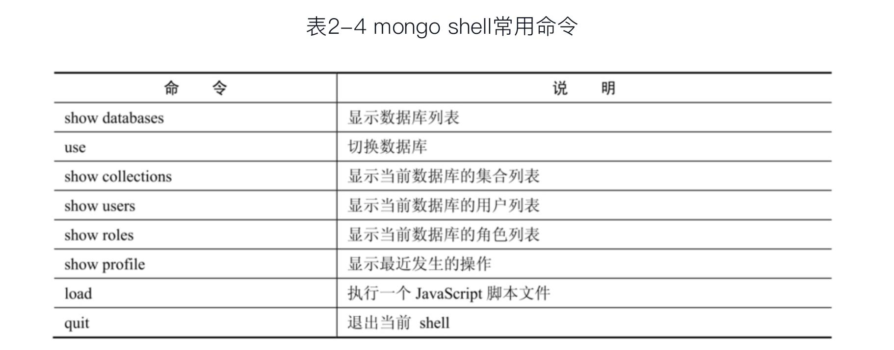

## 安装mongodb

下载地址：[Download MongoDB Community Server | MongoDB](https://www.mongodb.com/try/download/community)




然后开始安装，next，选择custom，修改安装路径



next



---

1、安装完成之后，接着下载MongoDB Shell

下载地址：https://www.mongodb.com/try/download/shell

将 Shell 解压到 MongoDB的安装路径下即可。


2、接着下载图形化管理界面 compass，下载完打开即可。

下载地址：https://www.mongodb.com/try/download/compass

3、将配置环境变量，使得可以全局使用 `mongod和mongosh` 命令

教程：https://blog.csdn.net/wangcuiling_123/article/details/78591084


## 使用mongodb

### 运行mongodb服务

进入安装路径 bin目录

```
mongod.exe --dbpath D:\MongoDB\data\db
```

会看到以下的地址和端口号




### 使用mongosh连接数据库

其中，--port选项用于指定数据库的监听端口。当然，默认连接的是本地数据库，如果需要连接远程数据库，则可以指定--host选项

```
mongosh --port 27017
```




---

参考文章：

https://www.cnblogs.com/chanshuyi/p/quick_start_of_mongodb.html

[Mongodb安装教程 - 沈威 - 博客园 (cnblogs.com)](https://www.cnblogs.com/shenweif/p/16626623.html)
