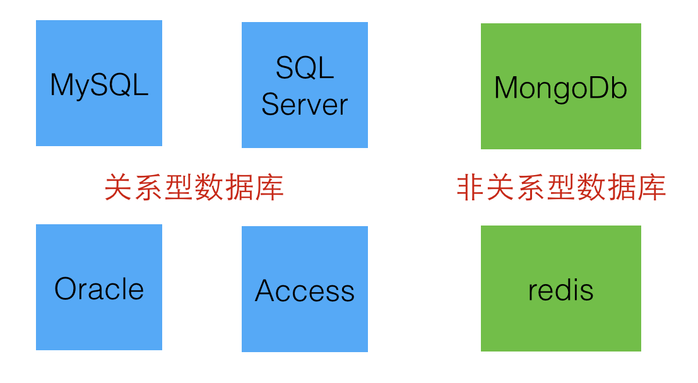
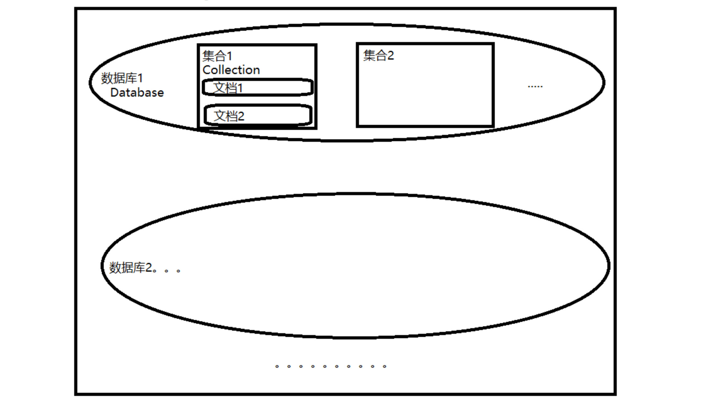

## MongoDB是什么

[MongoDB](https://baike.baidu.com/item/mongodb/60411?fr=aladdin) 由 C++语言编写，是一个介于[关系型数据库](https://so.csdn.net/so/search?q=关系型数据库&spm=1001.2101.3001.7020)和非关系型数据之间的产品，是非关系型数据库中功能最丰富，最像关系数据库的。它支持的数据结构非常松散，是类似与 `json` 的 `bson` 格式，因此可以存储比较复杂的数据类型。MongoDB 最大的特点是它支持的查询语言非常强大，其语法有点类似于面向对象的查询语言，几乎可以实现类似关系数据单表查询的绝大部分功能，而且还支持对数据建立索引。

常见的非关系型数据库还有：[Redis](https://redis.io/)，但 MongoDb 比 redis 更具有数据库的特性。

## MongoDb的基本数据结构

与 MySQL 等关系型数据库一样，MongoDb 也有类似的概念，但是其称呼不同。下表列出了 MongoDb 的基本数据结构以及与 MySQL 的对比。

| SQL术语/概念 | MongoDB术语/概念 |              解释/说明              |
| :----------: | :--------------: | :---------------------------------: |
|   database   |     database     |               数据库                |
|    table     |    collection    |            数据库表/集合            |
|     row      |     document     |           数据记录行/文档           |
|    column    |      field       |             数据字段/域             |
|    index     |      index       |                索引                 |
| table joins  |                  |        表连接,MongoDb不支持         |
| primary key  |   primary key    | 主键,MongoDb自动将_id字段设置为主键 |

可以看到 MongoDb 与 SQL 的数据库概念都是一致的，而 MongoDb 中数据库表（Table）则称之为集合（Collection），行（Row）则称为文档（Document），列（Column）则称为字段（Field）。

## 体系结构

数据库 -> 集合 -> 文档

