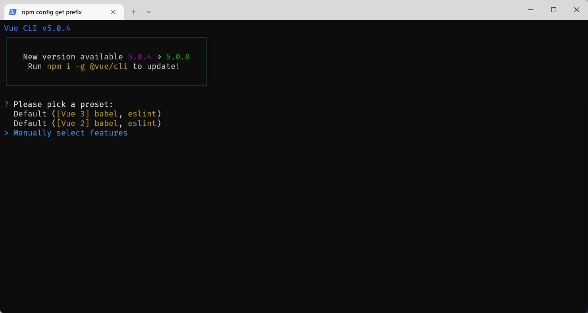
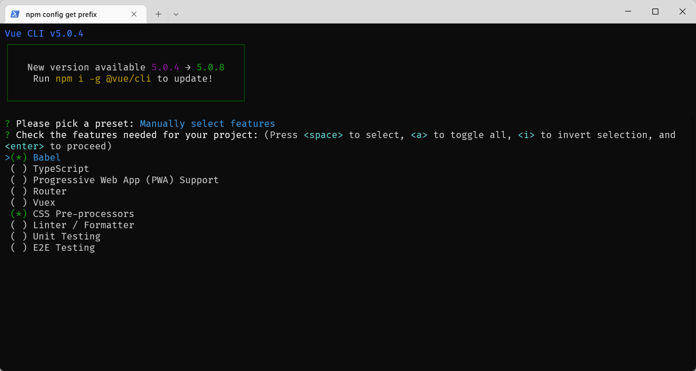
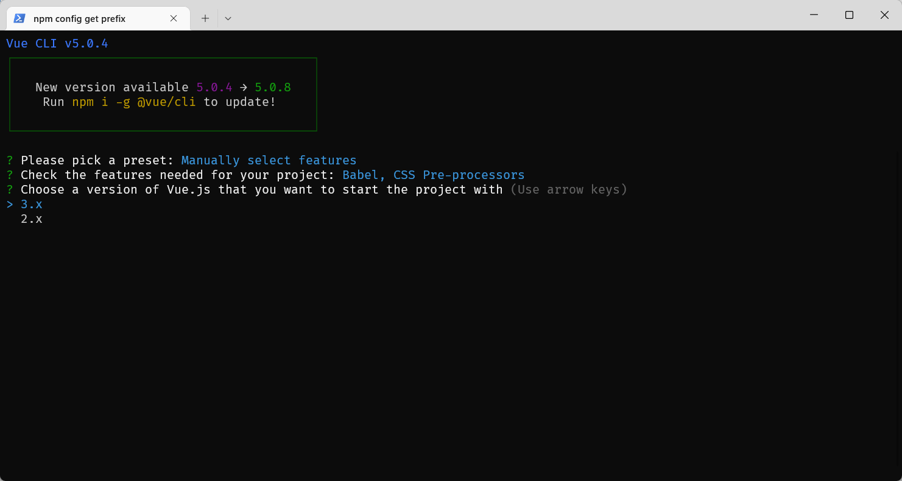
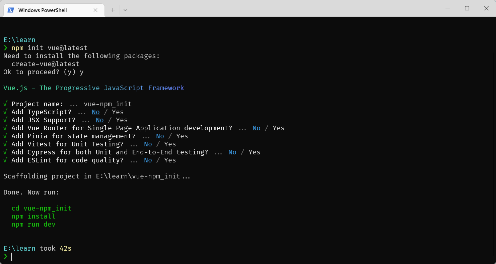
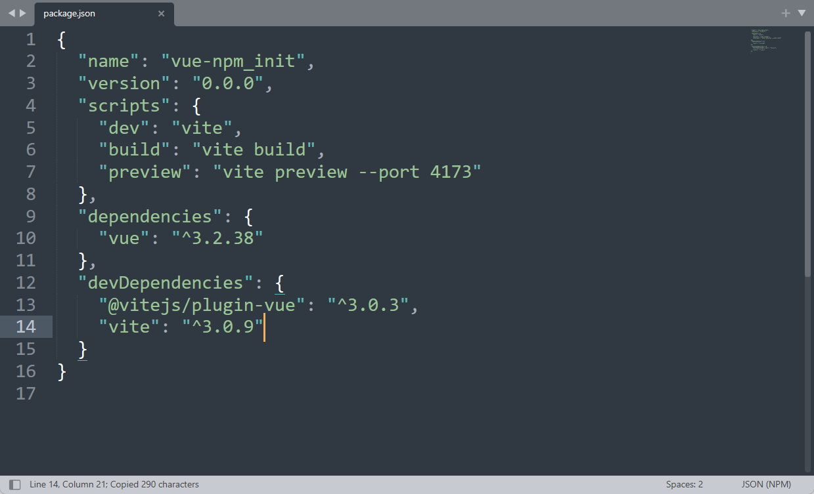

## 1、vue create(首选)

> create a new project powered by vue-cli-service
>
> 以这种方式创建的项目，vue版本是当前最稳定的版本，不是最新的。

首先打开控制台，输入下面的命令。

```bash
vue create 项目名称
```



按键盘上的上下键，选择 **Manually select features**（手动配置）。



通过↑ ↓ 箭头选择你要配置的项，按 空格 是选中，按 a 是全选，按 i 是反选，选择好了之后，敲击回车键。



现在选择Vue的版本。

可能需要选择 CSS 处理器的类型 - less

babel 配置的存放位置 - 单独的存放位置

是否保存当前的配置 - 不保存

## 2、vue ui

在浏览器打开一个图形化界面创建项目

可视化ui，这个没什么好说的。

```bash
vue ui
```

## 3、npm init

基于 **create-vue**，不同于 **vue-cli**

```sh
npm init vue@latest #或者 npm init vue@3
# 两者等效
```

安装最新版vue3，预置vite



```
npm init vue@2
```



以这种方法安装的是当前较新的vue2版本。

预置vite


## 4、vue init

> 从远程模板生成项目(遗留API，需要@vue/cli-init)

首先全局安装 `@vue/cli-init`

```
npm i -g @vue/cli-init
```

可以通过下面这条命令来创建Vue项目

```
vue init webpack project
```

## 区别

- `vue create` 命令是vue-cli3.x提供创建Vue项目的方式，模板是固定的，模板选项可自由配置。
- `vue ui` 命令也是vue-cli3.x提供创建Vue项目的方式，可以通过操作可视化页面来创建和管理Vue项目。
- `vue init` 命令是vue-cli2.x提供创建Vue项目的方式，可以使用github上面的一些模板来初始化项目。比如 webpack就是官方推荐的标准模板。