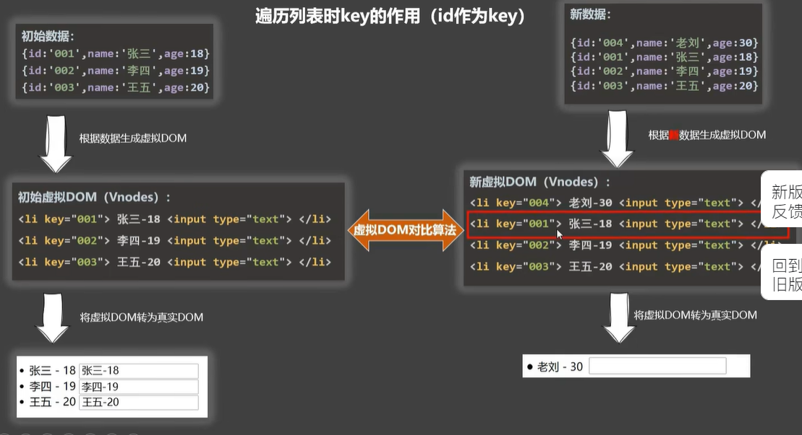
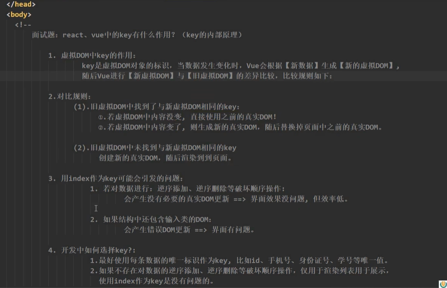

## 	v-for 指令

- 遍历数组
- 遍历对象
- 遍历字符串
- 遍历指定次数

```html
<!DOCTYPE html>
<html lang="zh-CN">

<head>
    <meta charset="UTF-8">
    <meta http-equiv="X-UA-Compatible" content="IE=edge">
    <meta name="viewport" content="width=device-width, initial-scale=1.0">
    <title>Vue</title>
    <script src="https://lf3-cdn-tos.bytecdntp.com/cdn/expire-1-M/vue/2.6.14/vue.js"
        type="application/javascript"></script>
</head>

<body>
    <div id="root">
       <ul>
        <!-- 有两个参数(内容和索引值) -->
        <!-- 遍历除了使用in，也可以使用of -->

        <!-- 遍历数组 -->
        <li v-for="(p,index) in persons" :key="index">{{p.name}} - {{p.age}}</li>
       </ul>

       <!-- 遍历对象 -->
       <ul>
        <li v-for="(value,key) in obj" :key="key">{{key}}:{{value}}</li>
       </ul>

       <!-- 遍历字符串 -->
       <ul>
        <li v-for="(i,index) in str" :key="index">{{i}}</li>
       </ul>

       <!-- 遍历指定次数 -->
       <ul>
        <li v-for="a in 5">{{a}}</li>
       </ul>
    </div>
    <script>
        Vue.config.productionTip = false;
        const vm = new Vue({
            el: '#root',
            data: {
                name: 'Vue',
                persons:[
                    {id:'001', name:'张三', age:22},
                    {id:'002', name:'李四', age:33},
                    {id:'003', name:'王五', age:43},
                ],
                obj:{
                    name:'奥迪双钻',
                    description:'我的伙伴',
                    price:'22元'
                },
                str: "Hello,Vue"
            },
            methods: {
            }
        })
    </script>
</body>

</html>
```

### Diff算法

先在新的虚拟DOM找出第一个节点，和对应旧的key的虚拟DOM的内容进行对比。如果有差异则重新生成真实DOM，如果没有差异则复用原来的真实DOM




### Key的注意事项

- key写元素的id还是索引值需要看具体情况
- 如果没有写key,vue将会默认以index作为key



## 参数

循环数组有两个参数，循环对象有三个参数。