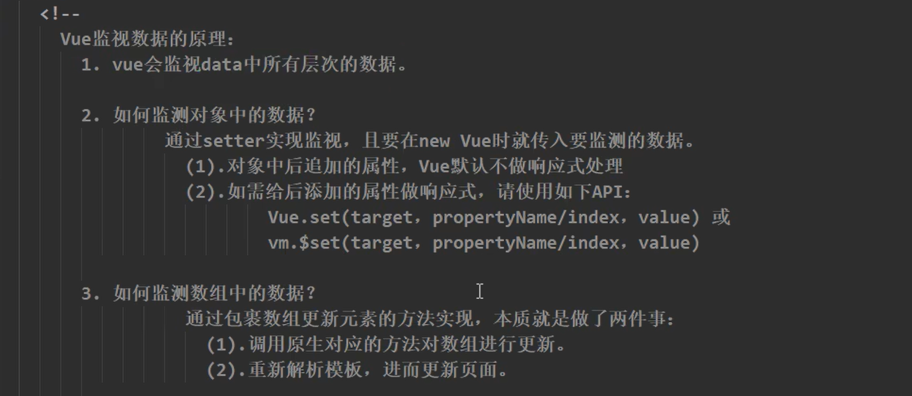
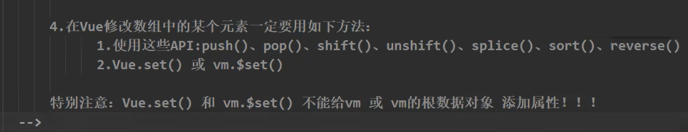
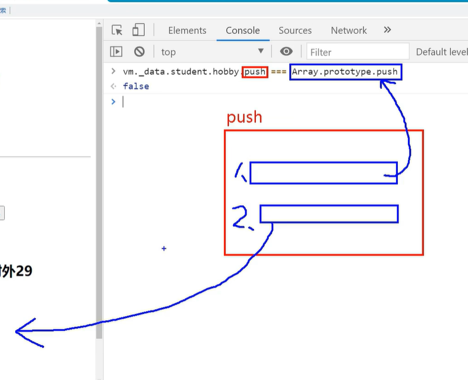

## 对象的数据监视

```html
<!DOCTYPE html>
<html lang="zh-CN">

<head>
    <meta charset="UTF-8">
    <meta http-equiv="X-UA-Compatible" content="IE=edge">
    <meta name="viewport" content="width=device-width, initial-scale=1.0">
    <title>Vue</title>
    <script src="https://lf3-cdn-tos.bytecdntp.com/cdn/expire-1-M/vue/2.6.14/vue.js"
        type="application/javascript"></script>
</head>

<body>
    <script>
        
        let data = {
            name:'lisi',
            age:22
        }
        const obs = new Observer(data)
        console.log(obs);
        let vm = {}
        vm._data = data = obs

        function Observer(obj){
            // 汇总对象中所有的属性形成一个数组
            const keys = Object.keys(obj)
            keys.forEach((k)=>{
                Object.defineProperty(this,k,{
                    get(){
                        return obj[k]
                    },
                    set(val){
                        console.log("我要开始忙了");
                        obj[k] = val
                    }
                })
            })
        }
    </script>
</body>

</html>
```

## Vue.set方法

在Observer函数初始化之后添加到Vue上面的变量，是不会有set和get，这时候可以用到set方面

`Vue.set() == vm.$set()`

```html
Vue.set(vm.stu[1],'age',200)
```

> set方法只能给data里面的某一个对象添加属性

## 数组的数据监视

> Vue只承认用push,pop,shift,splice等等方法修改了原数组的数据.
>
> 在此处调用的push等等已经不是原来的push了

也可以使用Vue.set方法修改


