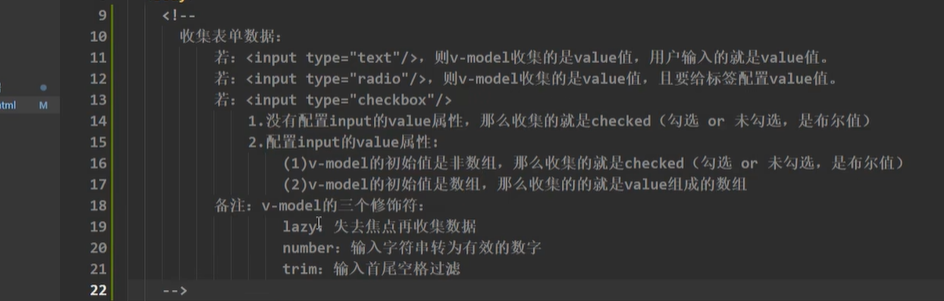

```html
<!DOCTYPE html>
<html lang="zh-CN">

<head>
    <meta charset="UTF-8">
    <meta http-equiv="X-UA-Compatible" content="IE=edge">
    <meta name="viewport" content="width=device-width, initial-scale=1.0">
    <title>收集表单数据</title>
    <script src="https://lf3-cdn-tos.bytecdntp.com/cdn/expire-1-M/vue/2.6.14/vue.js"
        type="application/javascript"></script>
</head>

<body>
    <div id="root">
        <!-- 表单提交事件 @submit -->
        <form @submit.prevent="demo">
            账号：<input type="username" v-model="userInfo.account">
            <br><br>
            密码：<input type="password" v-model="userInfo.password">
            <br><br>
            性别：男<input type="radio" value="male" v-model="userInfo.sex">女<input type="radio" value="female" v-model="userInfo.sex">
            <br><br>
            年龄：<input type="number" v-model.number="userInfo.age">
            <!-- v-model.number 修饰符进行类型转换 -->
            <br><br>
            爱好：学习<input type="checkbox" value="study" v-model="userInfo.hobby">吃饭<input type="checkbox" value="eat"
                v-model="userInfo.hobby">打游戏<input type="checkbox" value="game" v-model="userInfo.hobby">
            <br><br>
            所属校区：<select v-model="userInfo.city">
                <option value="">请选择校区</option>
                <option value="beijing">北京</option>
                <option value="shanghai">上海</option>
                <option value="shenzhen">深圳</option>
            </select>
            <br><br>
            其他信息：<textarea v-model="userInfo.other"></textarea>
            <br><br>
            <input type="checkbox" v-model="userInfo.accept">已阅读并接受<a href="http://www.baidu.com">《用户协议》</a>
            <button>提交</button>
        </form>

    </div>
    <script>
        Vue.config.productionTip = false;
        const vm = new Vue({
            el: '#root',
            data: {
                userInfo: {
                    account: '',
                    password: '',
                    sex: 'male', //性别默认是男
                    age:'',
                    hobby: [],//多组的多选框，需要绑定数组
                    city: 'beijing',
                    other: '',
                    accept: '',
                }
            },
            methods: {
                demo() {
                    console.log(JSON.stringify(this.userInfo));
                }
            }
        })
    </script>
</body>

</html>
```

>
>
>加：传的是js表达式，不加：传的是字符串
