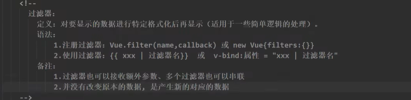

## 过滤器



对要显示的数据进行特定格式化后在显示出来。

> 此方法在Vue3版本中，已经不支持。

1. 局部过滤器
2. 全局过滤器
3. 过滤器一般应用于v-bind和插值语法

```html
<!DOCTYPE html>
<html lang="zh-CN">

<head>
    <meta charset="UTF-8">
    <meta http-equiv="X-UA-Compatible" content="IE=edge">
    <meta name="viewport" content="width=device-width, initial-scale=1.0">
    <title>格式化时间</title>
    <script src="./js/dayjs.min.js"></script>
    <script src="https://lf3-cdn-tos.bytecdntp.com/cdn/expire-1-M/vue/2.6.14/vue.js"
        type="application/javascript"></script>
</head>

<body>
    <div id="root">
        <!-- 计算属性实现 -->
        <h2>现在的时间是{{fmtTime}}</h2>
        <!-- methods实现 -->
        <h2>现在的时间是{{getfmtTime()}}</h2>
        <!-- 过滤器实现 -->
        <h2>现在的时间是{{time | formatTime('YYYY年MM月DD日')}}</h2>
        <!-- 多个过滤器，层层递进 -->
        <h2>当前的年份是{{time | formatTime('YYYY年MM月DD日') | mySlice}}</h2>
    </div>
    <script>
        Vue.config.productionTip = false;
        // 注册全局过滤器
        Vue.filter('demo',function(value){
            return value.slice(0,4)
        })
        const vm = new Vue({
            el: '#root',
            data: {
                time: 1655887906559
            },
            computed: {
                fmtTime(){
                    return dayjs(this.time).format('YYYY年MM月DD日 HH:mm:ss')
                }
            },
            methods: {
                getfmtTime(){
                    return dayjs(this.time).format('YYYY年MM月DD日 HH:mm:ss')
                }
            },
            // 过滤器先拦截数据，处理后再返回
            // 可叠加多个过滤器，过滤器会接受到一个固定的参数value
            // 局部过滤器
            filters: {
                // es6新特性，默认形参
                formatTime(value,str="YYYY年MM月DD日 HH:mm:ss"){
                    return dayjs(value).format(str)
                },
                mySlice(value){
                    return value.slice(0,4)
                }
            }
        })
    </script>
</body>

</html>
```

