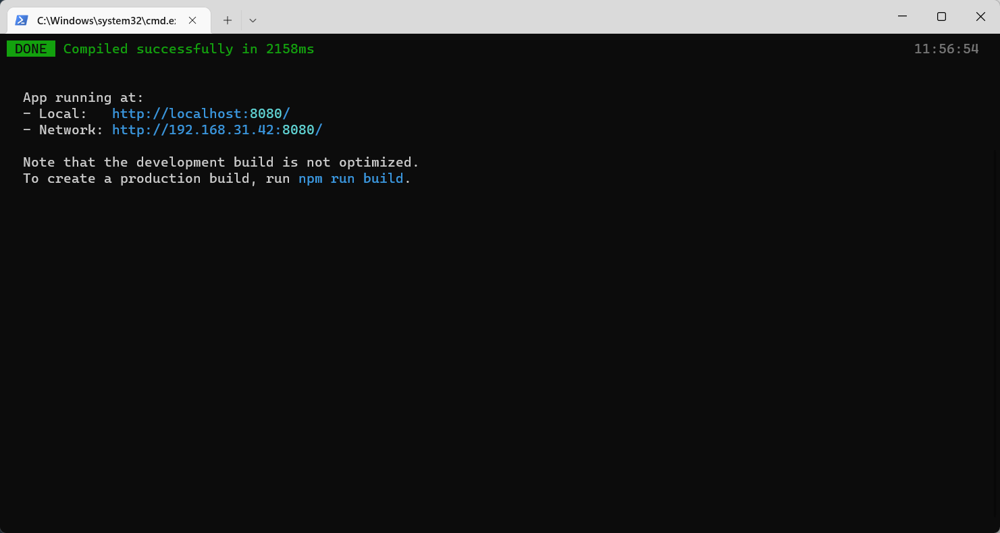

## 第一次运行成功



## 心得

不得不说脚手架是真的麻烦。

注意点如下：

1. 组件的命名有规范，一般的双驼峰命名，组件里面的name配置项要和组件文件名一致

2. 代码的缩进也有点问题，需要手动格式化文档。

3. 关闭代码的检查可以使用下面这一句加到**vue.config.js**里面
   ```
   lintOnSave: false,
   ```
4. 组件的data里面写数据一定要return出来啊。

## 输出Vue webpack配置文件

```bash
vue inspect > output.js
```

## 修改默认配置

参考文档：https://cli.vuejs.org/zh/config/#filenamehashing
