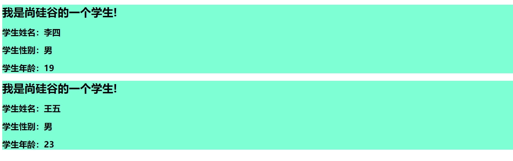

## props



允许自定义组件的数据

> 组件在复用，但是数据是动态的。

```html
<!--模板-->
<template>
  <div class="demo">
    <h1>{{msg}}</h1>
    <h2>学生姓名：{{name}}</h2>
    <h2>学生性别：{{sex}}</h2>
    <h2>学生年龄：{{age}}</h2>
  </div>
</template>

<!--配置项-->
props:['name','sex','age']
<!--组件标签-->
<Student name="李四" sex="男" age="18"></Student>
```

## props

> 通过props传输进来的数据不建议去修改。

```html
<!--简单的接收(使用该方法不应该去接收未传进来的数据)-->
props:['name','sex','age']
<!--接收的同时对数据的类型进行限制-->
props:{
  name:String,
  age:Number,
  sex:String,
}
<!--接收的同时对数据的类型和必要性的限制-->
props:{
  name:{
    type: String,
    required: true
  },
  age:{
    type: Number,
    default: 99,//默认值
    required: false
  },
  sex:{
    type:String,
    required: true
  },
}
```


## 小技巧

让传输进来的数字变成一个number型的数字

```html
<Student name="王五" sex="男" :age="22"></Student>
```

只需要在属性前加上冒号，让后面变成表达式传输进来即可。