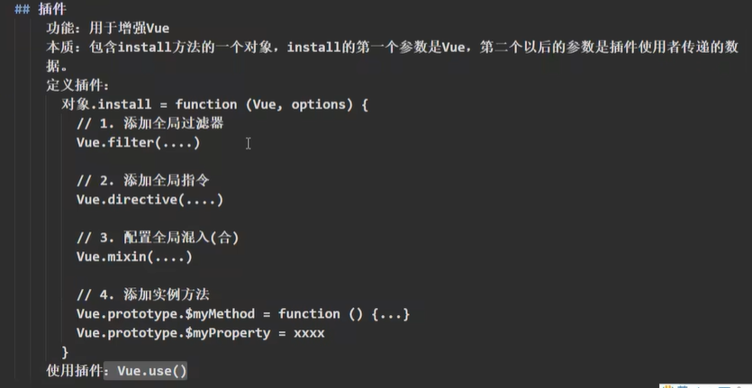

## 写插件

```JavaScript
export default{
    install(Vue){
        Vue.filter('mySlice',function(value){
            return value.slice(0,4)
        })
        //定义混合
        Vue.mixin({
            methods: {
                showName() {
                    alert(this.name)
                }
            },
        })
        //给Vue上添加一个方法
        Vue.prototype.hello = () => {
            alert("你好啊！")
        }
    }
}
```

## 引入插件

```javascript
// 引入插件
import plugins from './plugins'
```

## 使用插件

```javascript
// 使用插件
Vue.use(plugins)
```

## 插件的注意点

插件接收的第一个参数是Vue的构造函数

插件还可以接收第二个参数，作为使用者传递进来的参数。