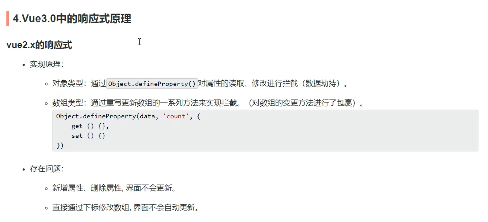
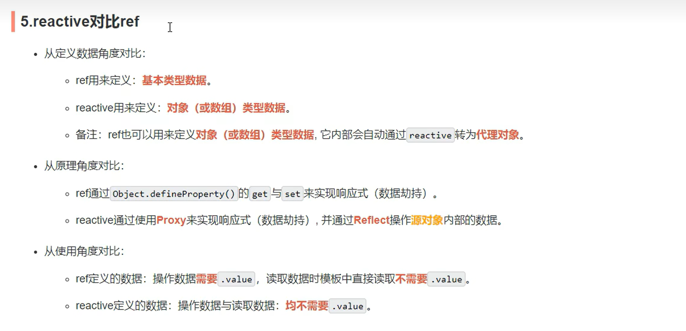

## Reactive

1.作用：定义一个对象类型的响应式数据（基本类型不要用它，要用`ref`)

2.语法：（接收一个对象或数组，返回一个代理对象）

```JavaScript
// 对象
let person = reactive({
  name:'李四',
  age:22
})

// 数组
let hobby = reactive(['唱','跳','rap'])
```

3.注意：`reactive`函数可以处理对象和数组类型的数据

> **模板中响应式数据更新会影响其他非响应式数据的更新**

4.`reactive`定义的响应式数据是 深层次的。内部基于`ES6`的`Proxy`实现，通过代理对象操作源对象内部数据进行操作。

## Vue2中的响应式原理 - defineProperty



解决方法:

1. `this.$set() == Vue.set()` 给一个数据追加一个响应式属性。
2. `this.$delete == Vue.delete`  响应式地删除一个属性。
3. 数组中的 `splice方法`

## Vue3中的响应式原理 - Proxy

响应式的两个重点：

- 代理（增删改查）-- Proxy代理
- 捕获
- 操作 -- Reflect

```JavaScript
let person = {
	name:'李四',
	age:22
}

const p = new Proxy(person,{
    // 读取时调用
	get(target,propName){
		console.log('person中的'+propName+'被读取了')
		return Reflect.get(target,propName)
	},
    // 修改或增加时调用
	set(target,propName,newV){
		console.log('person中的'+propName+'被修改了')
		Reflect.set(target,propName,newV)
	},
    // 删除时调用
	deleteProperty(target,propName){
		return Reflect.deleteProperty(target,propName)
		// 没写返回值，默认返回false
		// 而delete方法，当成功删除数据时会返回true，因此直接将这个结果返回出去即可
	}
})
```

> Object ==> Reflect
>
> 通过反射对象去操作

## ref和reactive的区别


