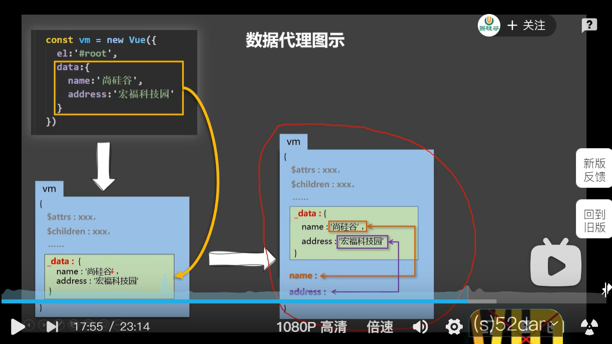

## Object.defineProperty(）

给对象添加属性，

第一个参数：对象名，

第二个参数：属性名，

第三个参数：属性值

> 通过该方法添加的属性默认是不参加遍历的，不可修改的，不可删除的。

### 代码示例

```JavaScript
Object.defineProperty(person,'age',{
    value:22,
    // 让添加的属性参加遍历，默认值是false
    enumerable:true
    // 让属性可以修改，默认值是false
    writable:true
    // 让属性可以删除，默认值是fasle
    configurable:true
    
})
```

### getter

```JavaScript
let age = 22
const person  = {
    name:'lily',
    sex:'female',
    age:age
}

Object.defineProperty(person,'age',{
    // 当person对象的age属性被读取时，会调用get函数。且返回的值会赋值给age。
    get:function(){
        return age
    }
})
```

对象的值会随着变量的改变而改变。

### setter

```javascript
let age = 22
const person  = {
    name:'lily',
    sex:'female',
    age:age
}
Object.defineProperty(person,'age',{
    // 当person对象的age属性被读取时，会调用get函数。且返回的值会赋值给age。
    get:function(){
        console.log("有人读取了age属性")
        return age
    },
    // 当person的age属性被修改时,setter函数就会被调用，且返回值是被修改后的值
    set(value){
        console.log("有人修改了age属性，值为",value);
        age = value;
    }
})
console.log(person)
```

当对象的属性被修改时会返回修改的值。

# 数据代理

定义：通过一个对象代理对另一个对象的属性进行操作（读/写）

### 代码示例

```JavaScript
const obj1 = {
    x:200
}
const obj2 = {
    y:100
}
Object.defineProperty(obj2,'x',{
    get(){
        return obj1.x
    },
    set(value){
        obj1.x = value
    }
})
console.log(obj1)
console.log(obj2)
```

## Vue中的数据代理



目的：让我们编码更加方便。

### vm中的_data还进行了数据劫持
