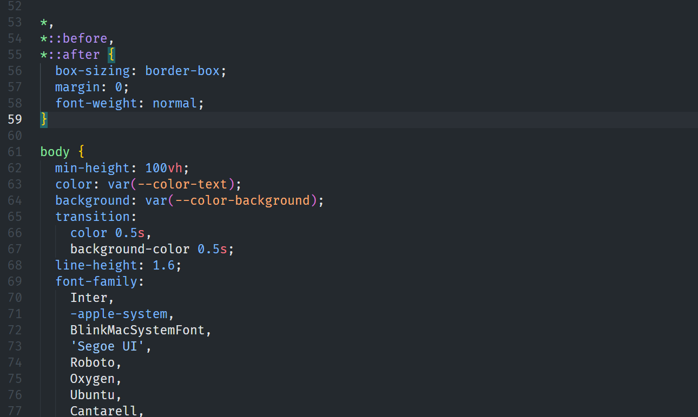

## 清空main.css

main.css文件里面会有一些样式，这些样式可能会影响我们的页面

## 如何引入阿里图标库

## 提示词

### CSS美化

- 用tailwindcss美化一下，精致一点

## ECharts表格初始宽度异常

这个是 **ECharts** 非常常见的坑：

### ⚡ 问题原因

- 在初始化时，`echarts.init()` 获取了当时 DOM 的宽度。
- 当时因为页面结构没完全渲染好或是父容器还没确定宽度，所以 ECharts 获取到的宽度是不对的（1/4）。
- 当你**打开开发者工具**或**手动改变窗口尺寸**时，ECharts 检测到窗口尺寸改变，会调用 `resize()`，然后显示正常。

### ⚡ 简单解决办法

✅ 在组件挂载完后，主动调用 `resize()`
 ✅ 或监听窗口改变，调用 `resize()`
 ✅ 或使用 `nextTick()` 确保 DOM 完全渲染再初始化
