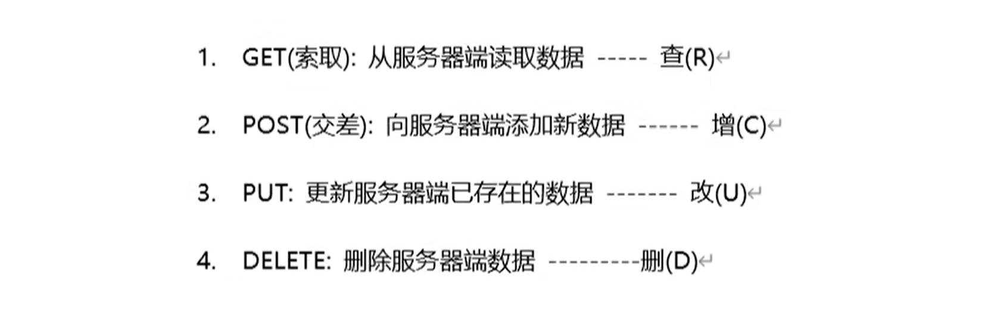
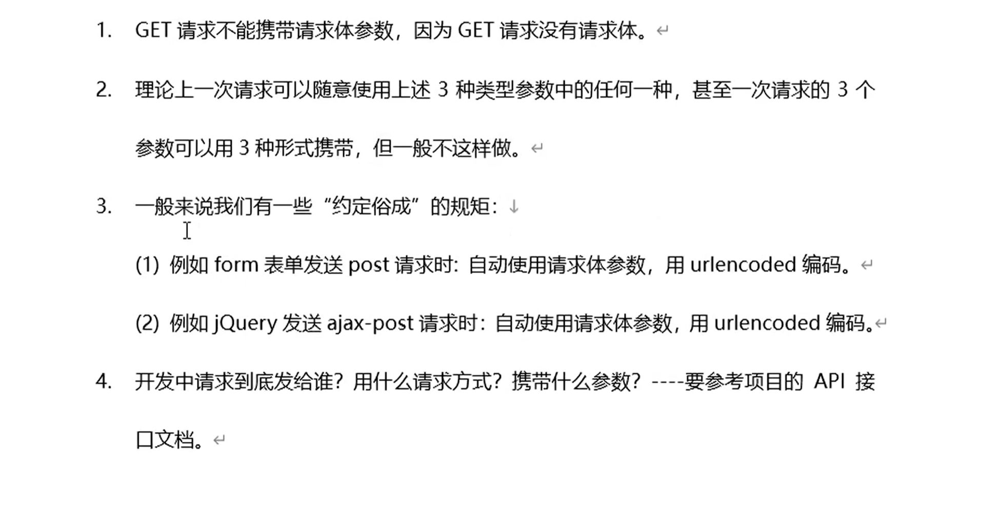
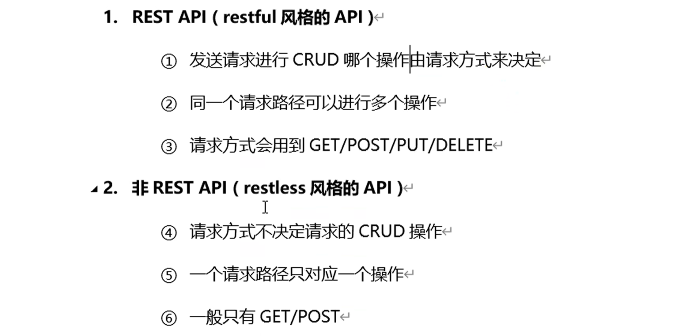
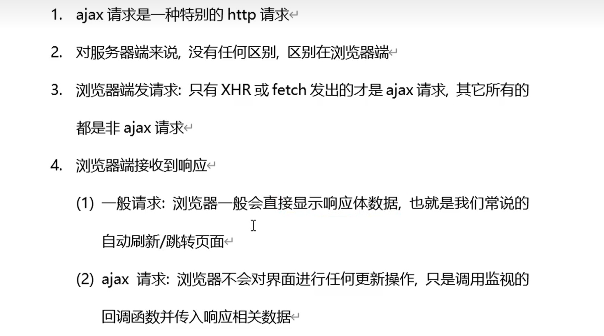

# 前置知识

## 请求方式



## 请求参数

四种请求方式可以和这三种参数任意搭配。

> 注意 body 请求体参数的请求体，如果是json格式的，请求头需要是` application/json`，如果是urlencoded格式的，请求体需要是 `application/x-www-form-urlencoded`

## 特别注意



## API的分类



## 一般请求和ajax请求的区别



## 测试服务器


# 正式开始

## 注意事项

- axios 调用的返回值是 Promise实例。

- 成功的值叫 response，失败的值叫 error。

- axios 成功的值是一个 axios 封装的 response 对象，服务器返回的真正数据在 response.data 中。

- 携带 query 参数时，编写的配置项叫做 params。

- 携带 params 参数时，没有任何配置项给你用，需要自己手动拼在 url 中。

## get请求

```JavaScript
axios({
    method: 'get',
    url: 'http://localhost:5000/person',
    // 坑emmm,此处写的是params，但是携带的是query参数
    // axios 没有设置params参数的配置项，如果真需要写，只能手动往url上加
    params: {
        id: 1,
    },
}).then(
    (response) => {
        console.log(response.data)
    },
    (error) => {
        console.log(error)
    }
)

// 精简版
// 携带参数时，配置一个对象，对象里面配置params 
axios.get('http://localhost:5000/person', { params: { id: 1 } }).then(
    (response) => {
        console.log(response.data)
    },
    (error) => {
        console.log(error)
    }
)
```

## post请求

```JavaScript
// 完整版
axios({
    url: 'http://localhost:5000/person',
    method: 'post',
    // 携带请求体参数(默认是JSON编码)
    data: {
        name: personName.value,
        age: personAge.value,
    },
    // urlencoded编码，axios会自动变更请求头为x-www-form-urlencoded
    // data: `name=${personName.value}&age=${personAge.value}`,
}).then(
    (response) => {
        console.log(response.data)
    },
    (error) => {
        console.log(error)
    }
)

// 精简版
axios
    // 携带请求体参数，直接写参数对象
    .post('http://localhost:5000/person', {
        name: personName.value,
        age: personAge.value,
    })
    .then(
        (response) => {
            console.log(response.data)
        },
        (error) => {
            console.log(error)
        }
    )
})
```

## put请求

```JavaScript
// 完整写法
axios({
    url: 'http://localhost:5000/person',
    method: 'put',
    data: {
        id: person_id_update.value,
        name: person_name_update.value,
        age: person_age_update.value,
    },
}).then(
    (response) => {
        console.log(response.data)
    },
    (error) => {
        console.log(error)
    }
)
// 精简版
axios
    .put('http://localhost:5000/person', {
        id: person_id_update.value,
        name: person_name_update.value,
        age: person_age_update.value,
    })
    .then(
        (response) => {
            console.log(response.data)
        },
        (error) => {
            console.log(error)
        }
    )
```

## delete请求

```JavaScript
// delete请求，携带 params参数
axios({
    url: `http://localhost:5000/person/${person_id_delete.value}`,
    method: 'delete',
}).then(
    (response) => {
        console.log(response.data)
    },
    (error) => {
        console.log(error)
    }
)
})
```

## 常用配置

```JavaScript
// axios 常用配置项
axios({
    url: 'http://localhost:5000/persons', // 请求地址
    method: 'get', // 请求方式
    // params: '{a:1,b:2}', // 携带query参数
    // data: { c: 3, d: 4 }, // 携带请求体参数(JSON编码)
    // data: `e=5&f=6`, // 携带请求体参数(urlencoded编码)
    timeout: 2000, // 配置超时时间(单位毫秒)
    // headers: { demo: 123 }, // 配置请求体
    responseType: 'json', //配置响应数据的格式(默认是json)
}).then(
    (response) => {
        console.log(response.data)
    },
    (error) => {
        console.log(error)
    }
)
```

## 全局配置axios

```JavaScript
// 全局配置axios
axios.defaults.baseURL = 'http://localhost:5000'
axios.defaults.timeout = 2000
axios.defaults.headers = { demo: 123 }

// 但是不能这样写
// axios.defaults = {
//     timeout: 2000,
//     baseURL: 'http://localhost:5000',
//     headers: { demo: 123 },
// }
```

## Axios.cerate

当我们配置的全局配置和我们使用的配置产生冲突时。可以使用 create 方法，创建一个独立的 axiso

```JavaScript
// 再创建一个新的axios
const axios2 = axios.create({
    baseURL: 'https://www.yecss.cn',
})
```

> 这个新的axios 只是没有，取消请求和批量发送请求的功能。

## 拦截器

当我们发出请求时，拦截器会对我们的请求进行检查，根据需要也可以对我们的请求进行处理。

拦截器有两种：

- 请求拦截器

- 响应拦截器

## 请求拦截器

本质是一个真正发请求前执行的一个回调函数。

作用：对所有的请求做统一的处理：追加请求头，追加参数，界面loading提示等等。

```JavaScript
 <script>
    const btn1 = document.getElementById('btn1')
    // 动态加上请求头
    // 传入请求配置，然后返回出去
    axios.interceptors.request.use((config) => {
        // 当当前时间戳是偶数时，加上请求头
        if (Date.now() % 2 == 0) {
            config.headers.demo = '222'
        }
        console.log(config)
        return config
    })
    btn1.onclick = async function () {
        try {
            const a = await axios.get('http://localhost:5000/persons')
            console.log(a.data)
        } catch (error) {
            console.log(error)
        }
    }
</script>
```

## 响应拦截器

本质是一个得到响应后执行的一组回调函数。

作用：

若请求成功，对成功的数据进行处理。

若请求失败，对失败进行进一步处理。

```JavaScript
// 响应拦截器
axios.interceptors.response.use(
    (response) => {
        console.log('响应拦截器成功的回调执行了')
        return response.data
    },
    (error) => {
        console.log('响应拦截器失败的回调执行了')
        // 返回失败的Promise
        return Promise.reject(error)
    }
)

// 统一处理错误 demo 
<script>
    const btn1 = document.getElementById('btn1')

    // 响应拦截器
    axios.interceptors.response.use(
        (response) => {
            console.log('响应拦截器成功的回调执行了')
            if (Date.now() % 2 == 0) {
                return response.data
            } else {
                console.log('当前的时间戳是奇数')
            }
        },
        // 统一处理错误
        (error) => {
            console.log('响应拦截器失败的回调执行了')
            alert(error)
            // return Promise.reject(error)
            return new Promise(() => {})
        }
    )

    btn1.onclick = async function () {
        const result = await axios.get('http://localhost:5000/persons')
        console.log(result)
    }
</script>
```

# 取消请求

## 基本使用

```JavaScript
const { CancelToken } = axios
let cancelMark = 0

btn1.onclick = () => {
    axios({
        url: 'http://localhost:5000/test1',
        method: 'get',
        cancelToken: new CancelToken((c) => {
            // c是一个函数，调用c就可以关闭这个请求
            cancelMark = c
        }),
        params: {
            delay: 2000,
        },
    }).then(
        (response) => {
            console.log(response.data)
        },
        (error) => {
            console.log(error)
        }
    )
}
btn2.onclick = () => {
    cancelMark()
}

// 新版 controller 方法
const controller = new AbortController()
btn1.onclick = () => {
    axios({
        url: 'http://localhost:5000/test1',
        method: 'get',
        signal: controller.signal,
        params: {
            delay: 2000,
        },
    }).then(
        (response) => {
            console.log(response.data)
        },
        (error) => {
            console.log(error)
        }
    )
}
btn2.onclick = () => {
    controller.abort()
}
```

## 案例

### 旧版axios

```JavaScript
<script>
    const btn1 = document.getElementById('btn1')
    const btn2 = document.getElementById('btn2')
    const { CancelToken, isCancel } = axios
    let cancelSignal = 1
    axios.interceptors.response.use(
        (response) => {
            console.log(response)
            return response.data
        },
        (error) => {
            if (isCancel(error)) {
                console.log('请求被取消了')
            } else {
                console.log(error)
            }
            return new Promise(() => {})
        }
    )
    btn1.onclick = () => {
        axios({
            url: 'http://localhost:5000/test1',
            method: 'get',
            cancelToken: new CancelToken((c) => {
                cancelSignal = c
            }),
            params: {
                delay: 1000,
            },
        }).then((response) => {
            console.log(response)
        })
    }
    btn2.onclick = () => cancelSignal() //可以参入参数
</script>
```

### 新版axios

```JavaScript
<script>
    const btn1 = document.getElementById('btn1')
    const btn2 = document.getElementById('btn2')
    const controller = new AbortController()
    axios.interceptors.response.use(
        (response) => {
            console.log(response)
            return response.data
        },
        (error) => {
            if (error.message == 'canceled') {
                console.log('请求被取消了!')
            } else {
                console.log(error)
            }
            return new Promise(() => {})
        }
    )
    btn1.onclick = () => {
        axios({
            url: 'http://localhost:5000/test1',
            method: 'get',
            signal: controller.signal,
            params: {
                delay: 1000,
            },
        }).then(
            (response) => {
                console.log(response)
            },
            (error) => {
                console.log(error)
            }
        )
    }
    btn2.onclick = () => {
        controller.abort()
    }
</script>
```

# 批量发送请求

```JavaScript
axios
    .all([
        axios.get('http://localhost:5000/test1'),
        axios.get('http://localhost:5000/test2?delay=2000'),
        axios.get('http://localhost:5000/test3'),
    ])
    .then(
        (response) => {
            console.log(response)
        },
        (error) => {
            console.log(error)
        }
    )
```